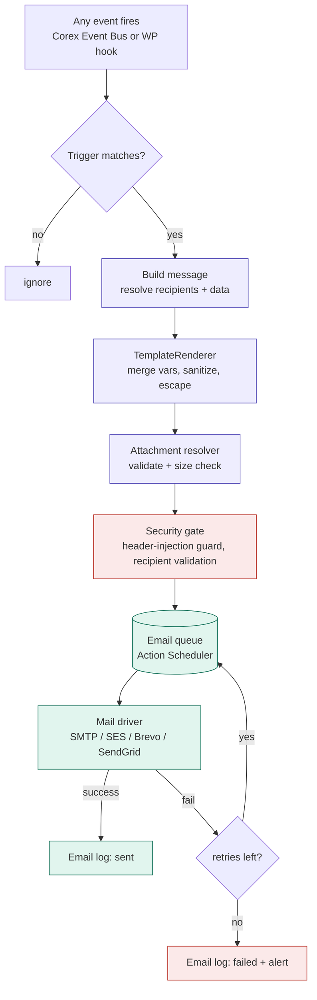

# Corex Mail (Email Studio) — Add-on Specification

**A professional, event-driven, secure email engine for Corex.**

> Create reusable templates, send custom emails after any event with dynamic data, attach files safely, and deliver reliably through a queue. Built entirely on the Corex Event Bus, Models, security middleware, and DataViews — it is an *application* of the framework, not a bolt-on.

| | |
|---|---|
| **Package** | `corex/email` |
| **Add-on name** | Corex Mail (Email Studio) |
| **Depends on** | corex-core (Event Bus, Models, QueryBuilder, Security, Config). No theme/block dependency. |
| **Optional integrations** | WooCommerce, Profile Manager, Forms, Polylang/WPML |
| **Last updated** | 2026-06-07 |

---

## 1. What it does (in one sentence)

When *anything* happens on the site, Corex Mail can render a chosen template with dynamic data from that event and deliver it — to anyone, with attachments, securely, through a retrying queue — with a full log and zero custom plumbing.

---

## 2. Core capabilities

1. **Template studio** — create, edit, preview, and version reusable email templates with merge variables.
2. **Event triggers** — bind any Corex/WordPress event to a template ("after X, email Y this template").
3. **Dynamic data** — merge variables resolved from the event payload, models, and the current user/site.
4. **Flexible recipients** — fixed address, role, dynamic from data, multiple recipients, CC/BCC, reply-to.
5. **Secure attachments** — from the media library or generated files (e.g. a PDF), validated and size-limited.
6. **Reliable delivery** — queued (Action Scheduler), retried on failure, rate-limited, provider-agnostic.
7. **Full audit log** — every send recorded (queued/sent/failed/bounced), viewable in a DataViews admin screen.
8. **Localized & RTL** — templates per language via the i18n abstraction; correct RTL rendering for Arabic.
9. **Compliance** — unsubscribe/suppression handling, consent awareness, retention policy.
10. **Developer API + CLI** — fire emails from code in one line; scaffold templates and triggers via the CLI.

---

## 3. Architecture

Corex Mail reuses the framework's spine. An event fires → a trigger matches it → the template renders with dynamic data → the message is validated and queued → a driver delivers it → the result is logged.



### Components

| Component | Responsibility |
|---|---|
| `EmailTemplate` (Model) | Template content, subject, variables, language, version |
| `EmailTrigger` (Model) | Maps an event → template → recipients → conditions |
| `TemplateRenderer` (Service) | Merges variables, sanitizes data, escapes output, applies layout |
| `RecipientResolver` (Service) | Resolves fixed/role/dynamic recipients, CC/BCC, reply-to |
| `AttachmentResolver` (Service) | Validates and prepares attachments (media or generated) |
| `EmailService` (Service) | Orchestrates build → validate → queue |
| `MailQueue` (Service) | Action Scheduler wrapper — enqueue, retry, rate-limit |
| `MailDriver` (interface) | `SmtpDriver`, `SesDriver`, `BrevoDriver`, `SendGridDriver` |
| `EmailLog` (Model) | Audit record per message |
| `SuppressionList` (Model) | Unsubscribed / bounced addresses |
| `MailController` | Admin UI (DataViews/DataForm), preview, test-send |

---

## 4. Template system

**Three authoring modes**, all producing the same stored template:

- **Visual** — block/section-based editor for non-developers (built with core components).
- **HTML** — paste/edit responsive HTML for full control.
- **Code-registered** — defined in a PHP class and committed to the repo (version-controlled, deployable).

**Merge variables** use a safe, explicit syntax — every variable is sanitized on resolve and escaped on output:

```
Hello {{ user.first_name }},

Your application for {{ career.title }} was received on {{ event.date }}.
{{ #if career.is_remote }}This is a remote role.{{ /if }}

Regards,
{{ site.name }}
```

Variables are resolved from a typed **context** assembled per send: `event.*` (the event payload), the relevant model(s) (`user.*`, `career.*`), and `site.*`. No arbitrary PHP execution in templates — the renderer only resolves whitelisted context paths.

**Layouts** — templates extend a shared layout (header/footer/brand) so all mail is on-brand and consistent. Layouts pull colors and logo from the active `brand.json` (same token system as the site).

**Localization** — a template has per-language variants; the `I18nHandler` picks the recipient's language. RTL layouts render correctly for Arabic.

---

## 5. Event triggers — "email after any action"

A trigger is a binding: **event + condition → template + recipients.** Triggers are created in the admin UI or registered in code.

**From the admin:** pick an event (e.g. `corex/form/submitted`, `woocommerce/order/completed`, `corex/career/applied`, `user/registered`), optionally add a condition (e.g. only when `order.total > 1000`), choose a template, and define recipients.

**From code (developer API):**

```php
// Fire a specific template after any event, with dynamic data
Mail::to($user->email)
    ->template('application-received')
    ->with(['career' => $career, 'event' => $event])
    ->attach($generatedPdf)
    ->queue();          // async; use ->send() to send immediately
```

Because triggers listen on the **Event Bus**, you can email after *any* action without touching the code that performs the action — exactly the decoupling the framework is built around. Adding an email to a new event = one trigger, zero changes elsewhere.

---

## 6. Recipients

Resolved by `RecipientResolver`, supporting:

- **Fixed** address(es).
- **Role-based** (e.g. all `editor` users, all site admins).
- **Dynamic** from the event/model (e.g. "the user who applied", "the post author", "the customer").
- **CC / BCC / Reply-To**, configurable per template or trigger.
- **Suppression-aware** — addresses on the suppression list (unsubscribed/bounced) are skipped automatically.

All resolved addresses are validated; invalid ones are dropped and logged, never sent.

---

## 7. Attachments — secure by design

Attachments are the most dangerous part of an email system. Corex Mail constrains them:

- **Sources allowed:** the WordPress media library (by attachment ID) or files generated by the framework at runtime (e.g. a PDF invoice). **Never** an arbitrary server file path supplied by a request — this prevents path-traversal data exfiltration.
- **Validation:** MIME-type allowlist (no executables), per-file and total size limits, file-count limit.
- **Generated files:** produced through a controlled service (e.g. the PDF skill), stored in a protected directory, and cleaned up after send.
- **No user-controlled paths** reach the filesystem layer — attachment requests reference IDs or service outputs, which the resolver maps to safe absolute paths internally.

```php
Mail::to($customer->email)
    ->template('invoice')
    ->with(['order' => $order])
    ->attachMedia($attachmentId)        // from media library
    ->attachGenerated($invoicePdf)      // framework-generated, protected
    ->queue();
```

---

## 8. Delivery, queue & reliability

- **Queued by default** via **Action Scheduler** — a slow SMTP call never blocks the page request that triggered it.
- **Retries** with backoff on transient failure; after max retries, the message is logged as failed and an alert fires (an event a listener can route to Slack/email/monitoring).
- **Rate limiting** — caps sends per minute/hour to respect provider limits and avoid spam flags.
- **Driver abstraction** — `MailDriver` interface with `SmtpDriver` (default), `SesDriver`, `BrevoDriver`, `SendGridDriver`. Switch via config; no code change.
- **Deliverability config** — from-name/from-address, reply-to, and guidance/checks for SPF/DKIM/DMARC. Credentials are stored encrypted (via the framework `Cryptor`), never in plaintext options.

---

## 9. Security model

Email security is treated as a first-class concern, applied automatically:

| Risk | Control |
|---|---|
| Header injection | Sanitize subject/recipient/header fields; reject newlines in headers |
| Template injection / XSS | Whitelisted context resolution; sanitize on resolve, escape on output; no PHP-eval in templates |
| Path traversal via attachments | No request-supplied file paths; media-ID or service-output only; MIME allowlist + size caps |
| Credential leakage | SMTP/API keys encrypted at rest; never logged; not in the repo |
| Admin abuse | Nonce + capability middleware on every admin action (send, edit template, edit trigger) |
| Spam / open relay | Rate limiting; suppression list; consent awareness |
| PII exposure | Email log redacts/limits stored body; retention policy purges old logs |
| Unauthorized sends | Test-send and manual-send require capability checks; triggers validated against allowed events |

All of this rides the framework's existing **security middleware** and **Validator** — Corex Mail declares requirements, it does not hand-roll checks.

---

## 10. Admin experience

Built with core **DataViews / DataForm** so it feels native and is accessible + RTL-aware:

- **Templates** — list, search, edit, duplicate, preview (desktop/mobile/RTL), send-test.
- **Triggers** — list, enable/disable, condition builder, recipient config.
- **Logs** — filterable table (status, date, recipient, template), with per-message detail and "resend".
- **Settings** — driver/provider, from-identity, rate limits, retention, suppression list.

---

## 11. Developer API & CLI

```bash
wp corex make:email-template invoice
wp corex make:email-trigger order-completed --event="woocommerce/order/completed"
wp corex email:test invoice --to=me@example.com   # render + send a test
wp corex email:queue:status                        # inspect the queue
wp corex email:log --status=failed                 # tail failures
```

```php
// One-liners from anywhere in the codebase
Mail::to($user->email)->template('welcome')->with(['user' => $user])->queue();
Mail::to($admins)->subject('New lead')->body($html)->send();           // ad-hoc
Mail::raw('text body')->to($addr)->send();                             // simple
```

---

## 12. Integrations (detect-and-defer)

- **Forms** — the Forms engine's `email` action delegates to Corex Mail when installed; falls back to basic `wp_mail` if not.
- **Profile Manager** — account emails (welcome, password reset, verification) use Corex Mail templates.
- **WooCommerce** — optionally override Woo's transactional emails with Corex Mail templates (HPOS-safe, via Woo hooks, never template-file overrides). Off by default; opt-in per email type.
- **Abilities/MCP** — expose a `send_email` ability (capability-gated) so an AI agent can send a templated email with dynamic data — securely, through the same gate.

---

## 13. Build plan (Spec Kit cycle)

Specify → plan → tasks → implement, in this internal order:

1. `EmailTemplate` + `EmailTrigger` models + migrations
2. `TemplateRenderer` (merge, sanitize, escape, layouts) + tests
3. `RecipientResolver` + `AttachmentResolver` (security-first) + tests
4. `MailDriver` interface + `SmtpDriver`; `MailQueue` (Action Scheduler) + retries
5. `EmailService` orchestration + the `Mail` facade + developer API
6. Event-Bus binding (`EmailTrigger` listens to events) + condition evaluation
7. `EmailLog` + `SuppressionList` + alerts on failure
8. Admin UI (DataViews/DataForm): templates, triggers, logs, settings
9. CLI generators + `email:test` / `email:log` / `email:queue:status`
10. Localization (i18n) + RTL rendering
11. Integrations: Forms, Profile Manager, WooCommerce, `send_email` ability

**Definition of done** (per the constitution): each piece has tests, passes `wp-guard` + `clean-code-guard` (and `woo-guard` for the Woo integration), is i18n-ready, RTL-verified, documented, and `PROGRESS.md` is updated. End every step with a NEXT STEP block.

---

## 14. Why this is professional-grade

- **Decoupled** — email after any event without touching that event's code.
- **Safe** — header-injection, XSS, path-traversal, and credential risks all closed by default.
- **Reliable** — queued, retried, rate-limited; never blocks a request.
- **On-brand & localized** — shared layouts from `brand.json`, per-language templates, RTL-correct.
- **Observable** — full log, failure alerts, resend.
- **Extensible** — driver abstraction, developer API, CLI, and an AI ability.

This is the email system a commercial framework is expected to have — and because it reuses the Corex spine, it costs far less to build than a standalone plugin would.
