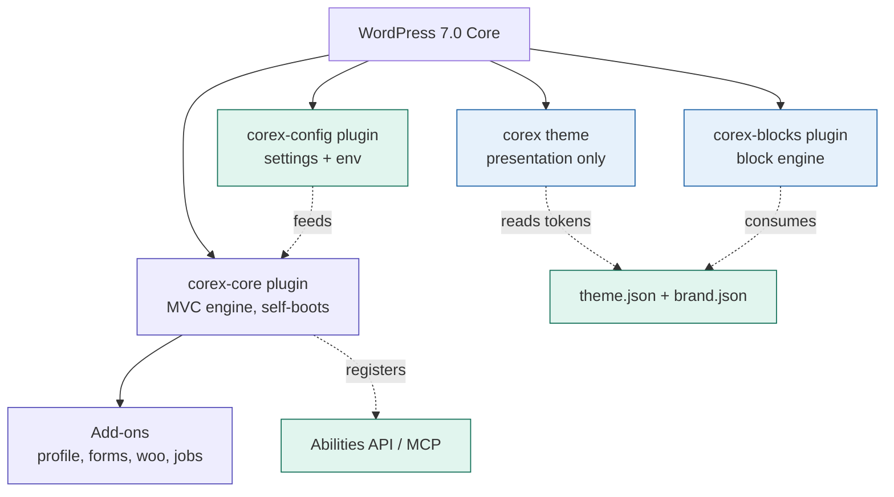
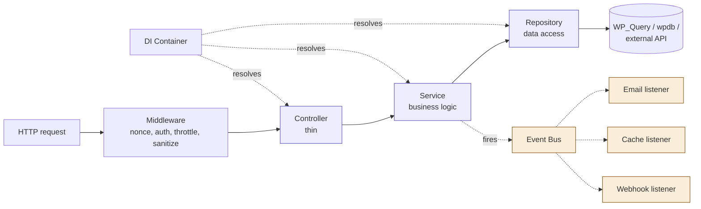
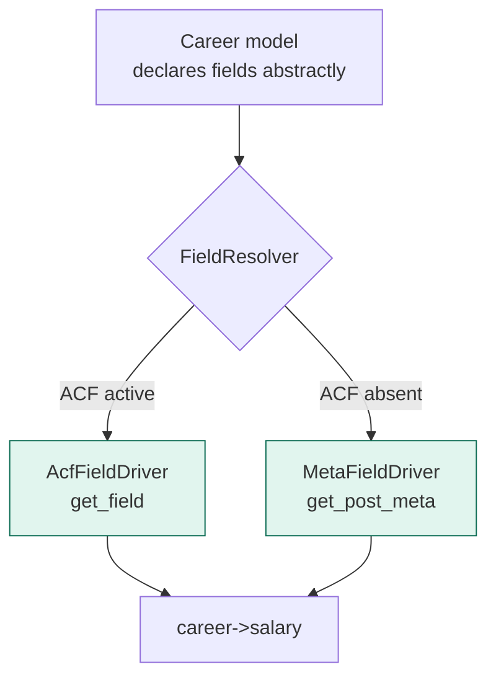
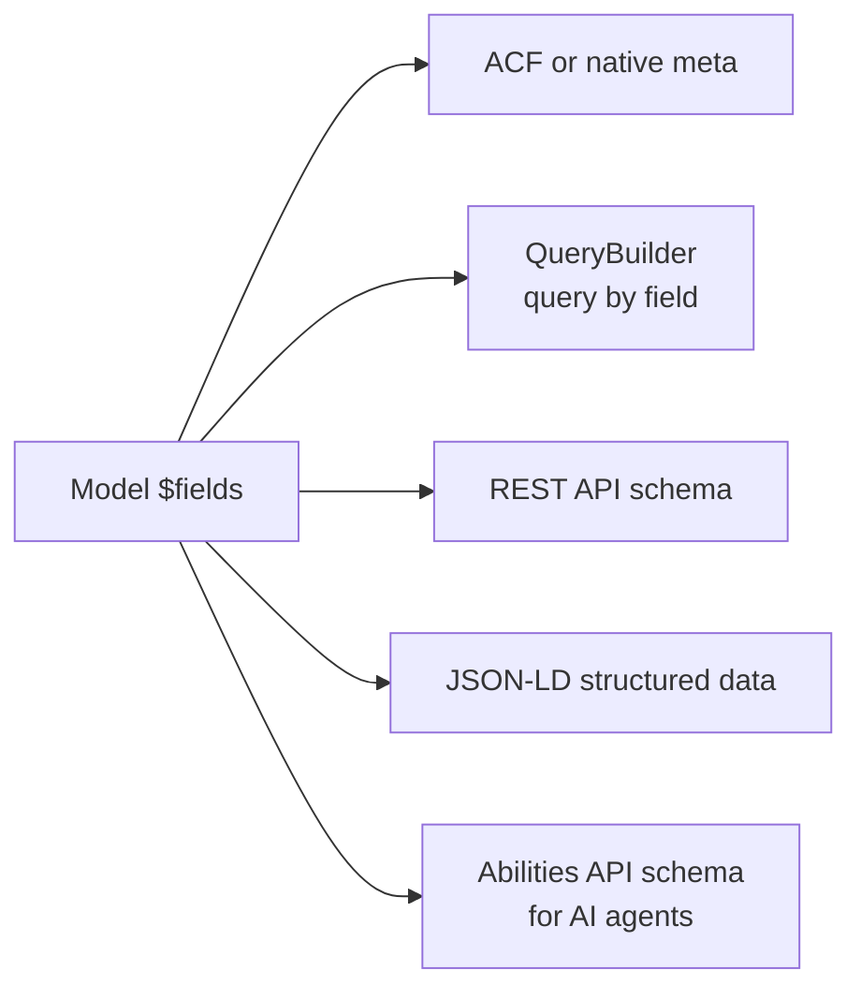
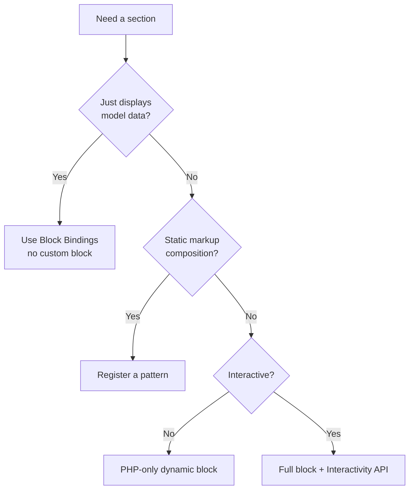
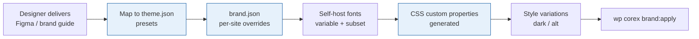
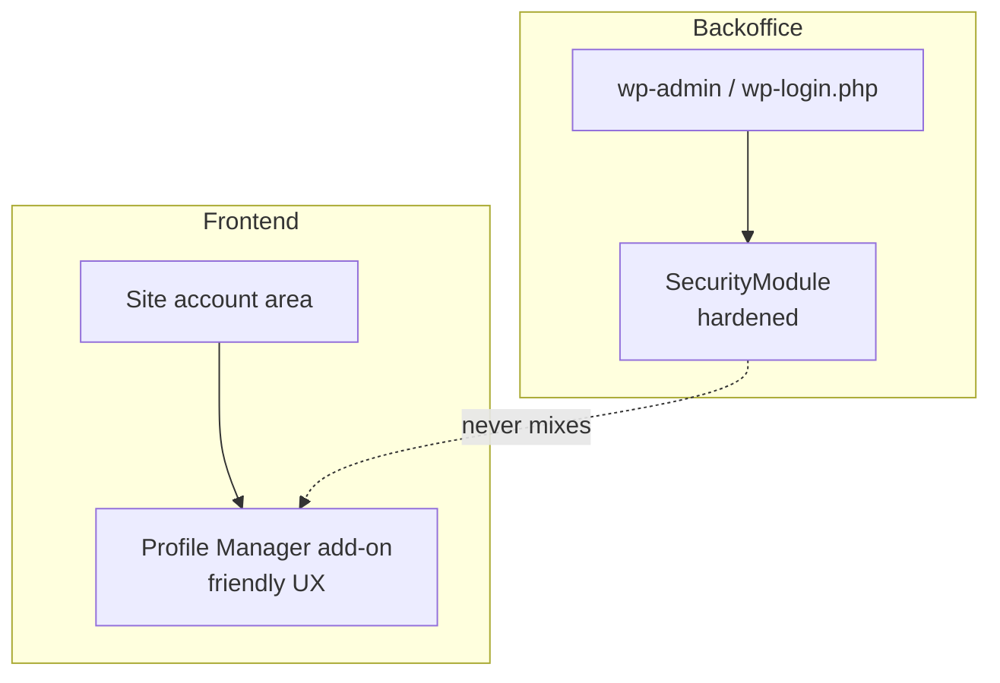
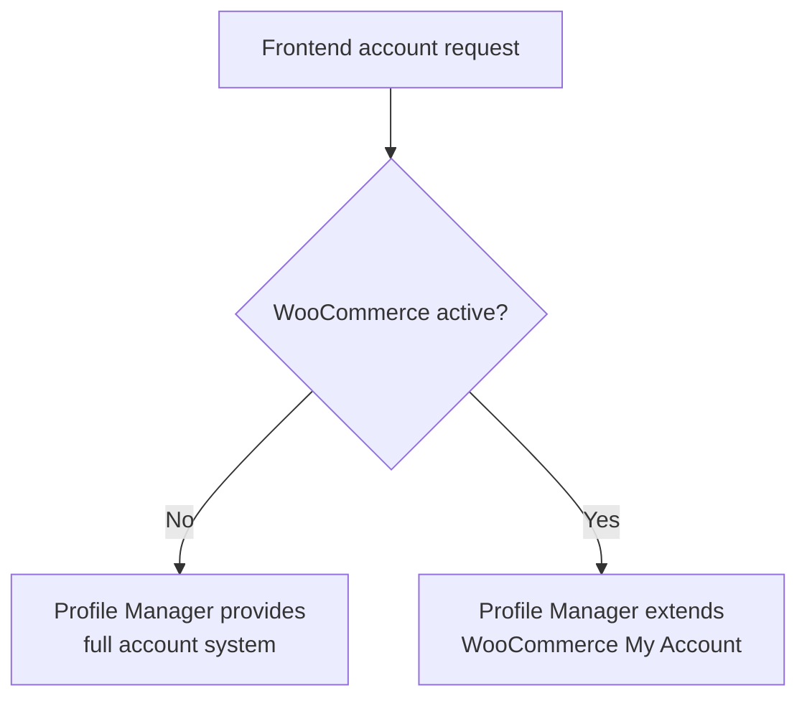
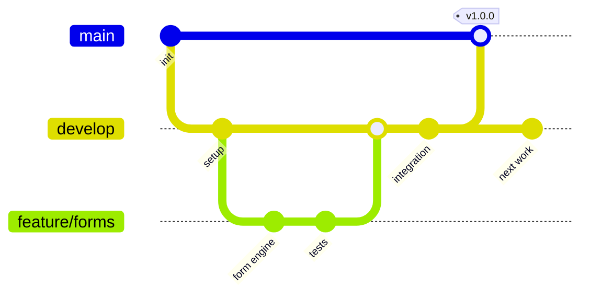

# Corex — WordPress Framework

**Master Reference & Developer Guide**

> A professional, Laravel-inspired WordPress framework. Build any site — corporate, e-commerce, multisite, headless, or AI-agent-driven — on one clean, documented, performant foundation.

| | |
|---|---|
| **Status** | Living document — keep updated with every architectural change |
| **Target stack** | WordPress 7.0+, PHP 8.3+, FSE (block themes) |
| **Maintainers** | Mustafa Shaaban + team |
| **Last updated** | 2026-06-07 |

---

## Table of Contents

1. [Philosophy & Constitution](#1-philosophy--constitution)
2. [Architecture Overview](#2-architecture-overview)
3. [The Laravel Parallel](#3-the-laravel-parallel)
4. [Repository & Directory Structure](#4-repository--directory-structure)
5. [The Design Pattern](#5-the-design-pattern)
6. [Models & the ACF-Optional Field System](#6-models--the-acf-optional-field-system)
7. [The Fluent QueryBuilder](#7-the-fluent-querybuilder)
8. [The CLI](#8-the-cli)
9. [Blocks Strategy](#9-blocks-strategy)
10. [Design Tokens & the Design Intake Workflow](#10-design-tokens--the-design-intake-workflow)
11. [The Forms Engine](#11-the-forms-engine)
12. [Security: Two Doors](#12-security-two-doors)
13. [Profile Manager & WooCommerce](#13-profile-manager--woocommerce)
14. [Add-on / Commercial Architecture](#14-add-on--commercial-architecture)
15. [Agent-Ready Layer](#15-agent-ready-layer)
16. [Internationalization & RTL](#16-internationalization--rtl)
17. [Performance](#17-performance)
18. [Testing Strategy](#18-testing-strategy)
19. [Git Flow & Deployment](#19-git-flow--deployment)
20. [Local Development](#20-local-development)
21. [Setup Wizard & Demo Content](#21-setup-wizard--demo-content)
22. [Building with AI](#22-building-with-ai)
23. [Recommended Tools & Plugins](#23-recommended-tools--plugins)
24. [How To: Start a New Project](#24-how-to-start-a-new-project)
25. [How To: Build a New Feature](#25-how-to-build-a-new-feature)
26. [Keeping This Document Alive](#26-keeping-this-document-alive)
27. [Glossary](#27-glossary)

---

## 1. Philosophy & Constitution

These are the non-negotiable rules of Corex. Every contributor — human or AI — reads this first. When a tool, skill, or generated code conflicts with these rules, the rules win.

1. **The theme is a skin, not a skeleton.** The theme holds presentation only — templates, parts, patterns, tokens. No business logic, no CPT registration, no plugin bootstrapping. Deactivating the theme breaks presentation, never data or API.
2. **Plugins boot themselves.** Core initializes on `plugins_loaded`, independent of any theme, working in CLI, REST, admin, and cron.
3. **Thin controllers, fat services.** Controllers route and validate. Services hold business logic. Repositories own data access. Models describe shape. No exceptions.
4. **Everything is injected.** Dependencies come through the PSR-11 container, never instantiated inside methods. This is what makes the framework testable.
5. **Design tokens are runtime, never build-time.** `theme.json` is the single source of truth, exposed as CSS custom properties. No build-time token systems (no Tailwind tokens, no Bootstrap variables).
6. **Assets load conditionally.** A block's CSS/JS loads only when that block is on the page. No global library loading. Ever.
7. **Security is declarative and automatic.** Routes declare middleware (`nonce`, `auth`, `throttle`, `sanitize`). Controllers never write security checks by hand.
8. **RTL is a first-class citizen.** Logical CSS properties by default. Arabic layouts are correct by default, not patched afterward.
9. **No optional dependency is a hard dependency.** ACF, WooCommerce, Polylang, WPML — all are detected and adapted to. The framework runs fully without any of them.
10. **The spec is the source of truth.** Code is generated from the specification. When intent changes, the spec changes first.

---

## 2. Architecture Overview

Corex is five independent layers. Each has one responsibility and can be reasoned about — and tested — alone.



**Layer responsibilities:**

| Layer | Owns | Never touches |
|---|---|---|
| **Theme** | FSE templates, parts, patterns, style variations, token consumption | Business logic, CPTs, data |
| **corex-blocks** | Block registration (auto-discovery), conditional assets, Interactivity API, connectors | Business logic |
| **corex-core** | Boot, DI container, **config resolution engine + `Config` facade** (`.env`→options→defaults precedence), hook registry, controller discovery, controllers, services, repositories, models, QueryBuilder, middleware, events, abilities | Presentation |
| **corex-config** | Admin settings UI, config/`.env` **management** (editing the values the core engine reads), feature flags, GTM, security headers | Business logic, the config resolution engine itself |
| **Add-ons** | Optional domain features (profile, forms, jobs, e-commerce extensions) | Each other (loosely coupled) |

> **Config split (clarified 2026-06-08, DECISIONS #19):** the low-level **config resolution engine**
> (`.env` → WP options → defaults precedence) and the `Config` facade live in **corex-core/Support**, so
> the engine self-boots and core stays self-sufficient (Principle II). **corex-config** owns the
> *management* surface on top — the admin settings UI, feature flags, GTM, security headers — and is
> always active. An earlier draft of the table above placed ".env resolution" wholly under corex-config;
> this note is the authoritative reading.

**Operation modes** (switched via `corex mode:set` or a `wp-config.php` constant): `fse`, `builder`, `headless`, `woo`, `multisite`. Same codebase, different controller/block subsets activate.

---

## 3. The Laravel Parallel

Corex deliberately mirrors Laravel concepts so any Laravel developer is productive in minutes.

| Laravel | Corex | Notes |
|---|---|---|
| `php artisan` | `wp corex` | The CLI, built on WP-CLI |
| `make:model` / `make:controller` | `corex make:model` / `make:controller` | Stub-based generators |
| Eloquent | `QueryBuilder` + `Model` | Fluent, but a wrapper not a full ORM (see §7) |
| Migrations | `corex make:migration` / `migrate` | Version-controlled schema for custom tables |
| Seeders | `corex make:seeder` / `seed` | Demo/initial data |
| Service Container | PSR-11 container | `Corex::make(CareerService::class)` |
| Facades | Static accessors | `Config::get()`, `Cache::remember()` |
| Middleware | Route middleware | Declared per route, applied automatically |
| Events / Listeners | Event Bus | Typed events, decoupled side effects |
| `.env` | `.env` + config layer | Same resolution philosophy |
| Blade | FSE templates + blocks | The WordPress-native view layer |
| Eager loading `with()` | `->with()` | Prevents N+1 (see §7) |

The goal: a developer thinks *"how would I do this in Laravel?"* and the Corex answer is almost identical.

---

## 4. Repository & Directory Structure

A monorepo managed by Composer (PHP) and npm workspaces (JS). One `composer install`, one `npm run build` from the root.

```
corex-framework/
├── theme/                          # parent theme — presentation only
│   ├── theme.json                  # design tokens (single source of truth)
│   ├── style.css
│   ├── templates/                  # FSE templates (*.html)
│   ├── parts/                      # header, footer, overlays
│   ├── patterns/                   # PHP-registered patterns
│   └── styles/                     # style variations (dark, alt, brand)
│
├── plugins/
│   ├── corex-core/                 # MVC engine
│   │   ├── src/
│   │   │   ├── Boot.php             # self-init on plugins_loaded
│   │   │   ├── Container/           # PSR-11 DI container
│   │   │   ├── Controllers/
│   │   │   ├── Services/
│   │   │   ├── Repositories/
│   │   │   ├── Models/
│   │   │   ├── Fields/              # ACF-optional field drivers
│   │   │   ├── Database/            # QueryBuilder, migrations
│   │   │   ├── Http/                # middleware, routing, REST
│   │   │   ├── Events/              # event bus, listeners
│   │   │   ├── Abilities/           # AI ability registration
│   │   │   ├── Security/            # SecurityModule
│   │   │   └── Support/             # helpers, facades
│   │   └── composer.json
│   │
│   ├── corex-blocks/               # block engine
│   │   ├── src/blocks/             # one folder per block
│   │   ├── src/connectors/         # model → block-binding connectors
│   │   └── package.json
│   │
│   └── corex-config/               # settings + env
│
├── addons/                         # optional, installable
│   ├── corex-profile-manager/
│   ├── corex-forms/
│   └── corex-woo/
│
├── packages/
│   ├── cli/                        # wp corex commands + stubs
│   ├── build-tools/                # shared webpack/vite/gulp config
│   └── phpcs-config/               # coding standard
│
├── docs/                           # THIS FILE + HOOKS.md, MODES.md, etc.
├── specs/                          # Spec Kit specs + constitution
├── tests/                          # Pest, Jest, Playwright
├── .github/workflows/              # or azure-pipelines.yml
├── composer.json                   # root, PSR-4 autoload
├── package.json                    # root, npm workspaces
├── wp-env.json                     # Docker local dev
├── .env.example
├── CLAUDE.md / AGENTS.md           # AI agent entry point
└── README.md
```

---

## 5. The Design Pattern

**Name:** Layered Architecture with a Service Layer (Martin Fowler) — MVC with a Service layer between Controller and Model, a Repository layer between Service and the database, plus a DI Container, an Event Bus (Observer), and Middleware for cross-cutting concerns.



**Where logic lives:**

- **Controller** — receives the request, validates input shape, calls one service method, returns a response. No DB calls. No business rules.
- **Service** — orchestrates business logic. Calls repositories, fires events. Does not query the database directly and does not echo output.
- **Repository** — the only place that talks to the data source. Wraps the QueryBuilder. Swappable behind an interface (WP_Query today, custom table or external API tomorrow).
- **Model** — describes the shape of an entity and its fields. A value object, not a god class.
- **Event Bus** — decouples side effects. A service fires `SubscriberRegisteredEvent`; independent listeners send email, flush cache, log. Adding a side effect = adding a listener, with zero changes to the service.

---

## 6. Models & the ACF-Optional Field System

**The requirement:** use the same model/controller logic whether or not ACF is installed. ACF must never be a hard dependency, and switching it on or off must not change how you write application code.

**The solution: a field-driver abstraction.** Models declare their fields *abstractly*. A `FieldResolver` picks a driver at runtime — ACF if present, native post meta if not. Your code calls `$career->salary` and never knows which driver answered.



**Model declaration (driver-agnostic):**

```php
namespace Corex\Models;

class Career extends Model
{
    protected string $postType = 'career';

    protected array $fields = [
        'salary'      => ['type' => 'number'],
        'department'  => ['type' => 'taxonomy', 'taxonomy' => 'department'],
        'deadline'    => ['type' => 'date'],
        'description' => ['type' => 'wysiwyg'],
        'is_remote'   => ['type' => 'boolean'],
    ];
}
```

**How each driver behaves:**

- **ACF present** → Corex generates an ACF field group from `$fields` using **ACF Local JSON** (committed to the repo, version-controlled, synced on deploy — never clicked in the admin). Reads go through `get_field()`. Editors get ACF's rich UI.
- **ACF absent** → Corex registers the same fields with native `register_post_meta()` (which also powers REST output and Block Bindings) and renders edit UIs via core's DataForm. Reads go through `get_post_meta()`.

**The payoff — one declaration feeds five systems:**



Define the shape of a `Career` once; the QueryBuilder, REST API, structured data, and AI abilities all derive from it. ACF becomes a *driver*, not a dependency — exactly the Laravel-style separation you want.

---

## 7. The Fluent QueryBuilder

A chainable wrapper over `WP_Query`, `WP_User_Query`, and `$wpdb` — Eloquent-like ergonomics without the full-ORM overhead or hidden queries.

```php
// Typed results, explicit eager loading, built-in caching
$careers = Career::query()
    ->where('status', 'publish')
    ->taxonomy('department', 'engineering')
    ->with('author')        // eager load — avoids N+1 (2 queries, not 11)
    ->orderBy('date', 'desc')
    ->cache(1800)           // object cache → Redis → transient fallback
    ->paginate(10)
    ->get();
```

**Why not a full ORM?** Full ORMs (Doctrine, Eloquent) load relationships transparently — which is exactly how N+1 sneaks in invisibly. The Corex QueryBuilder keeps every query *explicit*: you call `->with('author')` consciously, so you always know what fires. You get clean syntax and full control, with zero overhead beyond raw `WP_Query`.

**N+1 rule:** any time you loop over results and access a related entity inside the loop, add `->with()` for that relation. The QueryBuilder collects the related IDs and resolves them in a single batched query.

**Shared schema:** `Career::query()->toSchema()` outputs the model's JSON schema — reused by the REST API and the Abilities API so all three share one definition.

---

## 8. The CLI

`wp corex` is the Artisan-equivalent. Stub-based generators produce code that already follows the constitution and auto-registers itself.

```
# Project lifecycle
wp corex init --namespace="Acme" --prefix="acme" --mode=fse
wp corex mode:set {fse|builder|headless|woo|multisite}

# Generators (Laravel-style)
wp corex make:model Career --cpt --rest --ability
wp corex make:controller CareerController
wp corex make:service CareerService
wp corex make:repository CareerRepository
wp corex make:block hero-section --dynamic --php
wp corex make:migration create_subscribers_table
wp corex make:seeder CareerSeeder
wp corex make:middleware RateLimit
wp corex make:ability search_careers
wp corex make:form contact
wp corex make:child-theme "Client Name"

# Database
wp corex migrate
wp corex migrate:rollback
wp corex migrate:status
wp corex seed CareerSeeder

# Introspection (great for onboarding + audits)
wp corex hooks:list
wp corex routes:list
wp corex blocks:list
wp corex abilities:list

# Design + brand
wp corex brand:apply        # validate brand.json, generate CSS vars + critical CSS

# Operations
wp corex cache:flush
wp corex health:check       # security + performance + config audit
wp corex docs:generate      # branded developer guide from code

# Add-ons
wp corex install corex/profile-manager
```

The `health:check` command doubles as a paid service: run it on any client site for a prioritized audit report.

---

## 9. Blocks Strategy

**Native FSE dynamic blocks — not a page builder.** WordPress 7.0 closed the editability gap, so you get Bricks/Elementor-level control natively, without the bloat.

**Rules:**

- **Auto-discovery** — the block registry scans `build/*/block.json`. Adding a block = building it. No manual allowlist.
- **PHP-only blocks** (WP 7.0) for simple dynamic blocks (cards, alerts) — no JS build, inspector controls auto-generated from attributes via DataForm.
- **Block Bindings + Connectors** — register a connector per model so editors bind core blocks to your fields through the UI. Most "display a CPT field" blocks don't need to be custom blocks at all.
- **Full design tools enabled** — per-block CSS, width/height, breakpoint styles, pseudo-elements, per-device visibility (all WP 7.0). This is the editor power clients want.
- **Interactivity API** for all behavior (accordions via `<details>`, tabs, sliders, filters) — no jQuery, no Bootstrap JS.
- **Conditional assets** — each block declares its scripts/styles in `block.json`; they load only when the block renders.

**Decision tree:**



**Starter block set** (lean — ~10, since core now ships breadcrumbs, headings, icons): header, footer, page-hero, card, card-grid, section, button, post-grid, single-post, 404, no-results, alert.

---

## 10. Design Tokens & the Design Intake Workflow

**This is your answer to "a client gives me fonts, colors, typography — how do I apply a new design?"** Corex gives you a repeatable pipeline so a new brand is a configuration task, not a rebuild.



### Step 1 — Receive tokens

From the designer, collect: color palette (with named roles, not just hex), type scale, font families, spacing scale, border radii, shadows. If they use Tokens Studio in Figma, export the JSON.

### Step 2 — Map to `theme.json` (the single source of truth)

```jsonc
{
  "version": 3,
  "settings": {
    "color": {
      "palette": [
        { "slug": "primary",   "color": "#0B1F3B", "name": "Primary" },
        { "slug": "accent",    "color": "#00C2FF", "name": "Accent" },
        { "slug": "surface",   "color": "#FFFFFF", "name": "Surface" }
      ]
    },
    "typography": {
      "fontFamilies": [
        { "slug": "heading", "fontFamily": "Montserrat, sans-serif", "name": "Heading" },
        { "slug": "arabic",  "fontFamily": "'Noto Sans Arabic', sans-serif", "name": "Arabic" }
      ],
      "fontSizes": [
        { "slug": "sm",   "size": "clamp(0.875rem, 1vw, 1rem)",   "name": "Small" },
        { "slug": "lg",   "size": "clamp(1.25rem, 2vw, 1.5rem)",  "name": "Large" },
        { "slug": "hero", "size": "clamp(2.5rem, 6vw, 4rem)",     "name": "Hero" }
      ]
    },
    "spacing": {
      "spacingSizes": [
        { "slug": "30", "size": "1rem",  "name": "1" },
        { "slug": "50", "size": "2rem",  "name": "2" },
        { "slug": "80", "size": "4rem",  "name": "3" }
      ]
    }
  }
}
```

WordPress automatically exposes these as `--wp--preset--color--primary`, `--wp--preset--font-size--hero`, etc. Every block uses these variables — never a raw hex.

### Step 3 — Per-site overrides with `brand.json`

For multisite or per-client variants (the HHEO reality: each site its own colors/fonts on shared templates), a `brand.json` overrides only what differs. A `BrandResolver` injects these as CSS custom properties at runtime, resolved per `blog_id` — **no rebuild, no recompile.**

```jsonc
// addons or child: brand.json for "Blackstone"
{
  "name": "Blackstone eIT",
  "tokens": {
    "color.primary": "#0B1F3B",
    "color.accent":  "#00C2FF",
    "font.heading":  "Montserrat",
    "font.arabic":   "Cairo"
  },
  "logo": "assets/blackstone-logo.svg"
}
```

### Step 4 — Fonts (the HHEO lesson)

Self-host variable fonts, subset by `unicode-range` so Arabic loads only on Arabic pages and Latin only on Latin pages. One variable file per family covers all weights. `preload` only the first-screen font. Register in `theme.json` `fontFamilies` and the WP 7.0 Font Library. Never bundle 15 static font families.

### Step 5 — Style variations

Dark mode and alternate looks live in `theme/styles/*.json` as full style variations — not one-off CSS. Editors switch them in the Site Editor.

### Step 6 — Apply & validate

`wp corex brand:apply` validates the `brand.json`, regenerates the CSS-variable file and critical CSS per template, and confirms RTL variants. Done — the whole site is rebranded with zero code changes.

**The principle:** a new design is *data*, not *code*. Colors, fonts, and spacing flow through `theme.json` → CSS variables → blocks. Applying Blackstone's brand, or any future client's, is filling in tokens — never editing components.

---

## 11. The Forms Engine

Forms are an *application* of the architecture, not a separate system — they reuse the security middleware, event bus, and DataViews.

**Lifecycle:** define (code schema) → render (accessible, animated, Interactivity API) → submit (AJAX) → security + validation gate (nonce, CSRF, honeypot, rate limit, sanitize, spam) → dispatch `FormSubmittedEvent` → listeners (email, store, CRM/webhook) → animated response.

```php
wp corex make:form contact
```

```php
class ContactForm extends Form
{
    protected array $fields = [
        'name'    => ['type' => 'text',     'rules' => ['required', 'max:120']],
        'email'   => ['type' => 'email',    'rules' => ['required', 'email']],
        'message' => ['type' => 'textarea', 'rules' => ['required', 'max:2000']],
    ];

    protected array $actions = ['email', 'store'];
}
```

One definition feeds: the editor block, the REST endpoint, the admin submissions viewer (DataViews), and the validation gate. Add a side effect → add a listener. The form JS loads only on pages with a form block.

---

## 12. Security: Two Doors

Backoffice and frontend logins are separate concerns for different people.



**Backoffice (`SecurityModule`, auto-applied, secure defaults):** branded login screen, login rate limiting, optional 2FA, `DISALLOW_FILE_EDIT`, XML-RPC disabled, security headers (CSP/HSTS/X-Frame-Options), REST hardening (no user enumeration), forced SSL, version hidden, the nonce + capability middleware on every route.

**Frontend (Profile Manager):** branded on-site login/register, account dashboard, smooth animated UX, role-aware content. Customers never see `wp-admin`.

> Honesty note: changing the login URL is security-through-obscurity — offered as an *option* to reduce bot noise, never a replacement for the real measures above.

---

## 13. Profile Manager & WooCommerce

**Rule: detect and defer, never duplicate.**



When WooCommerce is absent, the Profile Manager provides the full account system. When WooCommerce is present, it *steps back* and only adds custom fields as new My Account tabs — never a competing account system. The same detection applies to cart/checkout/product blocks: Corex extends WooCommerce blocks, never replaces them. Result: zero conflict.

---

## 14. Add-on / Commercial Architecture

A lean free core drives adoption; revenue comes from add-ons — the proven model (ACF, Roots, the big players).

- **Free core:** theme + corex-core + corex-blocks.
- **Paid add-ons:** Profile Manager, **Corex Mail (Email Studio)**, WooCommerce Extensions, Job Board, Forms Pro, Multilingual Pack, Performance Pack.
- **Install via CLI:** `wp corex install corex/profile-manager`.
- **Extension API:** add-ons are Composer packages that register with the service container. Third parties can eventually build and sell Corex add-ons — your prefix becomes a namespace others build on.

---

## 15. Agent-Ready Layer

Built on WordPress 7.0's native **Abilities API** + official **MCP Adapter** — do not build a custom MCP server.

- `wp corex make:ability` registers an ability (input schema, output schema, permission callback) derived from a model/service.
- The core MCP adapter exposes abilities as MCP tools to Claude, Codex, Cursor — any MCP agent. Permissions are inherited from the WordPress user, so it is secure by default.
- Optional: the WP 7.0 **WP AI Client** + Connectors screen lets Corex offer AI-assisted authoring (alt text, summaries, AR/EN translation) provider-agnostically.
- Discovery files (`llms.txt`, `agent-card.json`) generated from config.

The model's `$fields` schema feeds the ability schema — one definition, agent-ready for free.

---

## 16. Internationalization & RTL

- **`I18nHandler` abstraction** wraps Polylang and WPML. Controllers call `$this->i18n->currentLanguage()` and never import either plugin's functions. Switch translators via `MWP_I18N_DRIVER` config — a one-line change.
- **Logical CSS properties** (`margin-inline-start`, `inset-inline-end`) everywhere → RTL correct by default. `postcss-rtlcss` handles edge cases only.
- **Fonts** subset by `unicode-range` per direction.

---

## 17. Performance

- **Conditional assets** — per-block loading, no globals.
- **Speculation Rules API** — prerender on hover for internal links (skip cart/checkout/admin); near-instant navigation.
- **Image pipeline** — auto WebP/AVIF on upload, `<picture>` output, native lazy loading, `fetchpriority="high"` on LCP image.
- **Critical CSS** — inline per-template above-the-fold CSS, defer the rest (RTL-aware).
- **Caching** — `CacheDriver` fallback chain (object cache → Redis → transient), explicit `->cache()` on queries, hook-based invalidation.
- **Client-side navigation** (Interactivity API) for SPA-like feel without being an SPA.

---

## 18. Testing Strategy

| Level | Tool | Targets |
|---|---|---|
| Unit | **Pest** (on PHPUnit) + Brain Monkey | Services, repositories (inject mocks via container) |
| Integration | Pest + wp-phpunit | REST endpoints, abilities, migrations |
| JS | Jest + `@wordpress/jest-preset` | Block edit components, attributes |
| E2E | Playwright (`@wordpress/e2e-test-utils-playwright`) | Subscription, search, contact, payment, RTL flows |

Pest is recommended over raw PHPUnit for cleaner syntax (more tests get written). CI gates every merge — no merge to `develop` without green tests.

---

## 19. Git Flow & Deployment

**Avoid the HHEO trap:** no long-lived `staging`/`production`/`qc` environment branches — they diverge and cause merge hell. Use **tags for releases, branches for work.**



**Branching model (git-flow-lite):**

- `main` — production-ready history only. Every merge is a tagged release.
- `develop` — integration branch.
- `feature/*` — short-lived, branched from `develop`, merged back via PR with green CI.
- `hotfix/*` — branched from `main` for urgent fixes, merged to both `main` and `develop`.

**Releases & deployment:**

- **Semantic versioning** (`v1.4.2`) + **Conventional Commits** → automated changelog and version bump in CI.
- **Environments deploy from tags, not branches.** Staging deploys `v1.4.0-rc.1`; production deploys `v1.4.0`. The tag is the single source of truth for what's live.
- **CI pipeline stages:** `lint` (PHPCS + ESLint) → `test` (Pest + Jest + Playwright) → `build` (strip source maps, bump version) → `package` → `deploy`.
- **Secrets** never in the repo — injected by CI from environment variables; `.env.example` documents required keys.

---

## 20. Local Development

- **wp-env (Docker)** is the team standard — `npx wp-env start` spins up identical PHP/MySQL/WP across Windows, Mac, Linux. Matches CI exactly.
- **WAMP** remains fine for solo personal work; the team and CI use wp-env for parity.
- **One root build:** `npm run build` (npm workspaces builds all packages in order); `composer install` at root installs all PHP deps.

---

## 21. Setup Wizard & Demo Content

A professional, commercial-theme onboarding — done the modern FSE way (not fragile XML dumps).

On first activation, a wizard (built with DataViews/React) runs: pick a starter style variation → choose modules to enable (WooCommerce, Profile Manager, Forms) → set brand colors/fonts (writes `brand.json`) → optionally import starter content via native **patterns + starter content**. Clean, fast, unbreakable — and a genuine selling point for the developers who buy your add-ons.

---

## 22. Building with AI

Corex is built *with* AI agents and usable *by* any LLM — so the structure is AI-first.

- **Spec-Driven Development (Spec Kit):** the spec, not the code, is the source of truth. Workflow: `/constitution` → `/specify` → `/clarify` → `/plan` → `/tasks` → `/implement`, reviewing between each task. Model-agnostic — works with Claude Code, Codex, Cursor, Gemini.
- **`specs/constitution.md`** — the rules in §1, formalized. Every agent reads it first.
- **Per-module specs** — write the spec before generating code. This conversation's decisions *are* the spec material.
- **Agent entry files** at repo root: `CLAUDE.md` / `AGENTS.md`, `ARCHITECTURE.md` (this file), `HOOKS.md`, `MODES.md`.
- **UI/UX skills (e.g. UI/UX Pro Max)** operate on the *presentation layer only*, leashed to the constitution: all styling through `theme.json` CSS variables, no framework dependencies, WordPress block contract respected. The skill is the designer; the constitution is the architect.

> Reality check from teams running this: generation is fast (hours), but stabilization, integration, and review still take days. The workflow only pays off when scope, contracts, and acceptance criteria are explicit *before* generation. That is what this document is for.

---

## 23. Recommended Tools & Plugins

| Need | Recommendation | Notes |
|---|---|---|
| Custom fields | **ACF** (via Local JSON) | Optional driver, not a dependency (§6) |
| Multilingual | **Polylang** (WPML-compatible via abstraction) | Lower query cost than WPML |
| E-commerce | **WooCommerce** | Detect-and-defer (§13) |
| SMTP | **Fluent SMTP** or SES/Brevo | Deliverability for transactional mail |
| Email queue | **Action Scheduler** | Async sending, retries — never blocks a request |
| AI guard gates | **guard-skills** (wp/woo/clean-code/test/docs) | Auto-install if missing; run on every diff |
| Build | **@wordpress/scripts** + Vite (theme CSS) | WP 7.0 directory builds |
| RTL | postcss-rtlcss + logical properties | Edge cases only |
| Testing | **Pest**, Jest, Playwright, Brain Monkey | §18 |
| Local dev | **wp-env** (Docker) | Cross-platform parity |
| Spec/AI | **Spec Kit** + Claude Code / Codex | Model-agnostic |
| Standards | PHPCS (WordPress-Extra), ESLint (@wordpress) | CI-enforced |
| Avoid | Bootstrap, Crocoblock as core deps | Conflict with token system + clean architecture |

---

## 24. How To: Start a New Project

```bash
# 1. Scaffold
composer create-project corex/framework my-project
cd my-project
wp corex init --namespace="Acme" --prefix="acme" --mode=fse

# 2. Local environment
npx wp-env start

# 3. Install dependencies
composer install && npm install && npm run build

# 4. Apply the client brand (§10)
#    edit theme.json + brand.json, then:
wp corex brand:apply

# 5. Enable the modules you need
wp corex install corex/forms
wp corex install corex/profile-manager   # if frontend users needed

# 6. Migrate + seed
wp corex migrate && wp corex seed

# 7. Verify
wp corex health:check
```

---

## 25. How To: Build a New Feature

Worked example — a "Careers" feature:

```bash
# 1. Spec first (Spec Kit)
/specify  "Careers: list/filter job openings, single job page, apply form"
/plan
/tasks

# 2. Generate the layers
wp corex make:model Career --cpt --rest --ability
wp corex make:repository CareerRepository
wp corex make:service CareerService
wp corex make:controller CareerController
wp corex make:block career-grid --dynamic
wp corex make:form job-application

# 3. Declare fields on the model (§6) — ACF or native, same code
# 4. Implement service logic; controller stays thin
# 5. Register the connector so editors bind blocks to Career fields
# 6. Write tests (Pest unit for service, Playwright for apply flow)
# 7. PR into develop → CI gates → merge → tag release
```

Each step follows the constitution because the generators produce constitution-compliant stubs.

---

## 26. Keeping This Document Alive

This file is a **living reference**. Rules:

- Any architectural change updates this document **in the same PR** as the code. A PR that changes architecture without updating docs fails review.
- `wp corex docs:generate` regenerates the auto-derived sections (hooks, routes, CLI, abilities) from code — run it in CI so the reference never drifts.
- Version this document alongside the framework. Tag it with releases.
- The `specs/constitution.md` mirrors §1 and is the machine-readable contract every agent reads.

---

## 27. Glossary

| Term | Meaning |
|---|---|
| **Ability** | A registered, typed, permission-checked capability exposed to AI agents (WP 7.0 Abilities API) |
| **Block Binding** | Connecting a core block attribute to a data source without a custom block |
| **Connector** | A registered data source editors can bind blocks to (WP 7.0 Connectors API) |
| **Driver** | A swappable implementation behind an interface (e.g. ACF vs native meta) |
| **Event Bus** | The dispatcher that decouples side effects from services |
| **Field Resolver** | Picks the field driver (ACF or native) at runtime |
| **Middleware** | Cross-cutting request handlers (nonce, auth, throttle) applied before controllers |
| **Mode** | An operation profile (fse, builder, headless, woo, multisite) |
| **Repository** | The only layer that talks to the data source |
| **Service** | Where business logic lives |
| **Style Variation** | A full alternate `theme.json` style (dark, alt brand) |
| **Token** | A named design value (color, size, spacing) in `theme.json` |

---

*Corex Framework — built to be inherited, extended, and trusted. Keep this document honest and current.*
