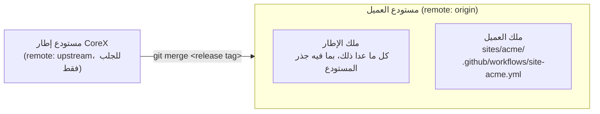

# تحديث CoreX داخل موقع العميل

يُبنى موقع العميل في مستودع خاص به. هذا المستودع نسخة من إطار CoreX وبجانبها موقع العميل، ويأخذ
كل إصدار جديد من CoreX عن طريق **الدمج** (merge). تشرح هذه الصفحة كيف تُعِدّ ذلك مرة واحدة، وكيف
تأخذ أي إصدار بعد ذلك.

تستخدم الأمثلة الاسم المحايد **Acme** ووسم الإصدار `v1.2.3`. استبدلهما باسم عميلك وبالإصدار الذي تأخذه.

> المصدر الإنجليزي: [`en/05-deployment/updating-a-client-site.md`](../../en/05-deployment/updating-a-client-site.md).
> الأوامر وأسماء الملفات والمسارات تبقى بالإنجليزية كما هي.

## كيف يتكوّن مستودع العميل



كل مسار في المستودع يتبع أحد الطرفين:

| المالك | المسارات | من يغيّرها |
|---|---|---|
| **العميل** | `sites/**` و `.github/workflows/site-*.yml` | أنت، بحرية. |
| **الإطار** | كل ما عدا ذلك — `plugins/` و `addons/` و `packages/` و `theme/` و `scripts/` و `tests/` و `docs/` وكل ملف في جذر المستودع | إصدار من الإطار، ولا شيء غيره. |

النمطان المملوكان للعميل مدوّنان في `.github/repository-ownership.json`. ويُعرَّف الإطار بأنه *كل ما
ليس في تلك القائمة*، فأي مجلد جديد يضيفه الإطار مشمول من يوم إضافته، وأي ملف شارد في الجذر لا يصبح
ملكك دون أن تدري.

**القاعدة التي تُبقي التحديث بلا تعارضات: عمل العميل لا يعدّل أبدًا مسارًا يملكه الإطار.** إصدار
الإطار لا يحتوي أي ملف تحت `sites/`، فلا يستطيع الدمج أن يكتب فوق موقعك. الطريقة الوحيدة للحصول
على تعارض هي أن تكون قد غيّرت شيئًا يغيّره الإطار أيضًا.

ويشمل ذلك مستندات الجذر. الملفات `README.md` و `PROGRESS.md` و `DECISIONS.md` و `CHANGELOG.md`
الموجودة في الجذر هي للإطار. نظائرها الخاصة بالعميل موجودة في `sites/acme/` وتُولَّد لك. ملفات
التصميم والملاحظات وكل ما يخص العميل مكانها `sites/acme/` أيضًا، ولها ملف `.gitignore` خاص بها.

## إنشاء مستودع العميل

تُنفَّذ هذه الخطوات مرة واحدة لكل عميل.

### 1. انسخ إصدارًا من CoreX إلى مستودع جديد

```bash
git clone --branch v1.2.3 https://github.com/MustafaShaaban/corex.git acme
cd acme
git switch -c main
git remote rename origin upstream
git remote set-url --push upstream DISABLED_DO_NOT_PUSH_TO_COREX
git remote add origin git@github.com:your-account/acme.git
git push -u origin main
```

أصبح `upstream` هو الإطار، وللجلب فقط: عنوان الدفع ليس عنوانًا حقيقيًا عن قصد، فأي دفع إليه يفشل
بدل أن يصل إلى الإطار.

```bash
git remote -v
```

```text
origin    git@github.com:your-account/acme.git (fetch)
origin    git@github.com:your-account/acme.git (push)
upstream  https://github.com/MustafaShaaban/corex.git (fetch)
upstream  DISABLED_DO_NOT_PUSH_TO_COREX (push)
```

### 2. ثبّته وشغّله محليًا

```bash
composer install
npm ci
npm run build
```

ثم أنشئ WordPress المحلي باسم يدل على المشروع — راجع
[Windows + WAMP](../00-getting-started/windows-wamp.md) لإعداد ملف hosts والـ virtual host:

```powershell
powershell -ExecutionPolicy Bypass -File .\scripts\setup-wordpress.ps1 `
  -SiteUrl http://acme.local -Title "Acme Website" -DbName acme -DbPrefix acme_wp_
```

### 3. ولّد الموقع

من جذر المستودع:

```bash
wp corex make:site Acme --dir=sites/acme --path=wp
```

```text
Success: Client site scaffolded: sites/acme
Edit only the client plugin/theme — never the Corex framework. See AGENTS.md.
```

الخيار `--dir` هو مكان الموقع. أما `--path` فهو خيار خاص بـ WP-CLI ويحدد مكان تثبيت WordPress،
ولا يمكن استخدامه لمجلد الموقع. أضف `--starter` للحصول على مثال يعمل تتعلم منه ثم تحذفه.

ولأن الموقع في `sites/acme`، يكتب الأمر أيضًا الملفات التالية، وهي ما يجعل الموقع قابلًا للتحديث:

| الملف | ما هو |
|---|---|
| `sites/acme/corex-baseline.json` | إصدار الإطار والـ commit الذي يقف عليه هذا الموقع. |
| `sites/acme/UPDATING-COREX.md` | هذا الإجراء في صورة قائمة تحقق، بمساراتك أنت في الأوامر. |
| `.github/workflows/site-acme.yml` | الـ CI الخاص بالعميل. لا يحتوي أي إصدار من الإطار ملفًا بهذا الاسم. |

اربط الموقع بـ WordPress المحلي بتشغيل سكربت الإعداد مرة أخرى. يربط إضافة العميل وقالبه ويطبع
الأمرين اللذين يفعّلانهما؛ ولا يفعّلهما بالنيابة عنك.

### 4. تأكّد من نقطة البداية، ثم نفّذ commit

```bash
npm run verify:framework
```

```text
framework	PASS	0 drifted	0 accepted exceptions	baseline v1.2.3 <commit>
```

```bash
git add sites .github/workflows/site-acme.yml
git commit -m "Add the Acme site"
git push
```

## العمل اليومي

اعمل داخل `sites/acme/` فقط. وقبل الدفع شغّل:

```bash
npm run verify:framework
```

يقارن هذا الأمر كل مسار يملكه الإطار بالـ commit المسجَّل في `corex-baseline.json`، ويحسب التغييرات
غير المحفوظة والملفات غير المتتبَّعة. كل ما يختلف يظهر بوصفه `DRIFT`:

```text
DRIFT	README.md
framework	FAIL	1 drifted	0 accepted exceptions	baseline v1.2.3 <commit>
```

تراجع عن التغيير، أو انقل ما كنت تحتاجه إلى `sites/acme/`. الـ workflow المولَّد يشغّل الفحص نفسه
عند كل pull request، ومعه تثبيت نظيف وبناء لحزم العميل واختبارات العميل نفسه. القائمة الكاملة لما
يطبعه الفحص موجودة في [`scripts/README.md`](../../../scripts/README.md).

## أخذ إصدار من CoreX

الملف `sites/acme/UPDATING-COREX.md` هو هذا القسم في صورة قائمة تحقق.

### قبل التحديث

1. **ابدأ من حالة نظيفة، وعلى فرع جديد.**

   ```bash
   git status
   git switch -c chore/corex-v1.2.4-update
   ```

2. **تأكّد أن ملفات الإطار هنا لم تُعدَّل.**

   ```bash
   npm run verify:framework
   ```

   يجب أن ينجح. إذا أظهر `DRIFT` فهناك ملف من ملفات الإطار عُدِّل في هذا المستودع وسيتعارض الدمج
   عنده. عالج ذلك أولًا.

3. **اقرأ ما يغيّره الإصدار بالنسبة للعميل.** افتح `CHANGELOG.md` في مستودع الإطار واقرأ قسم
   **Client impact** لكل إصدار بين الإصدار المسجَّل في `corex-baseline.json` والإصدار الذي تأخذه.
   الدمج النظيف ضروري لكنه لا يكفي: قد يغيّر الإصدار سلوكًا يعتمد عليه موقعك دون أن يمسّ سطرًا من
   كودك.

4. **دوّن كيف تبدو الصفحات العامة وكيف تتصرف الآن**، ليكون لديك ما تقارن به.

### التحديث

5. **اجلب الإصدار وادمجه.**

   ```bash
   git fetch upstream --tags
   git merge v1.2.4
   ```

   ما دامت ملفات الإطار بلا تعديلات محلية فلن تظهر تعارضات، ولن يتغير شيء تحت `sites/`. وإذا ظهر
   تعارض فراجع قسم [عند تعارض الدمج](#عند-تعارض-الدمج).

6. **ثبّت ما يحتاجه الإصدار، وابنِ أصول الإطار.**

   ```bash
   composer install
   npm ci
   npm run build
   ```

7. **ابنِ أصول العميل.** في `sites/acme/acme-site` و `sites/acme/acme-theme`، حيثما وُجد ملف
   `package.json`:

   ```bash
   npm ci        # or `npm install` where there is no lockfile
   npm run build
   ```

   هذه هي الخطوة التي تكشف حزمة يستوردها العميل دون أن يصرّح بها. مثل هذه الحزمة تُحَلّ من
   `node_modules` الخاص بالإطار إلى أن يأتي اليوم الذي يحذفها فيه أحد الإصدارات.

8. **طبّق أي تغيير في قاعدة البيانات يحمله الإصدار.**

   ```bash
   wp corex migrate --path=wp
   ```

   وأعد تشغيله في كل بيئة عند وصول الإصدار إليها.

### التحقق

9. **سجّل خط الأساس الجديد، ثم افحص مقابله.**

   ```bash
   npm run verify:framework -- --record v1.2.4
   npm run verify:framework
   ```

   ```text
   RECORDED	sites/acme/corex-baseline.json	v1.2.4	<commit>
   framework	PASS	0 drifted	0 accepted exceptions	baseline v1.2.4 <commit>
   ```

   الترتيب مهم. قبل التسجيل ما زال الفحص يقارن بالإصدار القديم فيعدّ التحديث نفسه انحرافًا. وبعد
   التسجيل يعني النجاح أن ملفات الإطار في هذا المستودع هي ملفات ذلك الإصدار بالضبط.

10. **شغّل اختبارات الإطار.**

    ```bash
    composer test
    npm run test:js
    ```

11. **شغّل اختبارات العميل نفسه**، وأعد البناء إن تغيّر شيء.

12. **قارن الصفحات العامة** بما دوّنته في الخطوة 4.

13. **نفّذ commit وافتح pull request.** يتضمن الـ commit الملف `sites/acme/corex-baseline.json`.
    وهو الملف الوحيد تحت `sites/` الذي يتغير خلال التحديث كله.

## عند تعارض الدمج

التعارض في مسار يملكه الإطار معناه أن هذا المسار عُدِّل في هذا المستودع. خذ نسخة الإطار:

```bash
git checkout --theirs -- README.md
git add README.md
git commit
```

أثناء الدمج تشير `--theirs` إلى الإصدار الجاري دمجه. وإذا كان التعديل مقصودًا فمكانه استثناء
مسجَّل — راجع القسم التالي.

لا يمكن أن يحدث تعارض في `corex-baseline.json` بسبب إصدار، لأن أي إصدار لا يحتوي هذا الملف.

## عندما يعطّل خللٌ في الإطار عمل العميل

بلّغ عنه في مستودع الإطار وخذ الإصلاح عن طريق التحديث. لا تُصلح الإطار لعميل واحد كإجراء معتاد.

وإذا لم يستطع العميل الانتظار، أصلح الملف هنا وسجّله، ليذكره الفحص بدل أن يفشل بسببه:

```json
{
  "release": "v1.2.3",
  "commit": "<the full commit hash>",
  "recorded": "2026-10-04",
  "exceptions": [
    {
      "path": "plugins/corex-core/src/Example.php",
      "reason": "Why this framework file is changed here.",
      "upstream": "https://github.com/MustafaShaaban/corex/issues/<number>"
    }
  ]
}
```

```text
EXCEPTION	plugins/corex-core/src/Example.php	Why this framework file is changed here.	https://github.com/…
framework	PASS	0 drifted	1 accepted exceptions	baseline v1.2.3 <commit>
```

عندما يصدر إصدار يحتوي الإصلاح لا يعود الملف مختلفًا، فيفشل الفحص ويصفه بـ `STALE`. احذف
الاستثناء حينها. ولا تُعِد تطبيق إصلاحك فوق إصلاح الإطار نفسه.

## مستودع عميل أقدم من هذه الصفحة

المستودع الذي أُنشئ قبل وجود هذه الأدوات ليس فيه سجل خط أساس. لاعتمادها عند تحديثه القادم:

1. خذ الإصدار كما سبق. يأتي معه الفحص وملف الملكية.
2. أنشئ الملف `sites/<client>/corex-baseline.json` بالمحتوى `{}`، ثم سجّل الإصدار:

   ```bash
   npm run verify:framework -- --record v1.2.4
   npm run verify:framework
   ```

3. كل ما يظهر بوصفه `DRIFT` هو تعديل محلي على ملف من ملفات الإطار. التعديلات التي وُجدت فقط
   لجعل أدوات الفحص واختبارات الإطار تقبل موقع العميل لم تعد لازمة: خذ نسخة الإطار من كل منها.
   وسجّل أي تعديل مقصود بوصفه استثناءً.

## أي طريق تحديث ينطبق

مستودع العميل الخاضع لإدارة النسخ يُحدَّث بهذا الإجراء، وبه وحده. أداة التحديث من لوحة التحكم
الموصوفة في [Updates & distribution](./updates-and-distribution.md) تستبدل ملفات الإضافة داخل
WordPress يعمل؛ وفي مستودع يرتبط فيه `wp-content` بالمصدر سيغيّر ذلك ملفات إطار متتبَّعة خارج git.
اترك عنوانها دون إعداد هناك.

## انظر أيضًا

- [Client-site workflow](../04-team-workflow/client-site-workflow.md) — العمل داخل `sites/<client>/`.
- [Shared-host dist artifact](./shared-host-dist.md) — بناء ما يُنشر.
- [`scripts/README.md`](../../../scripts/README.md) — شرح `verify-framework.mjs` كاملًا.
