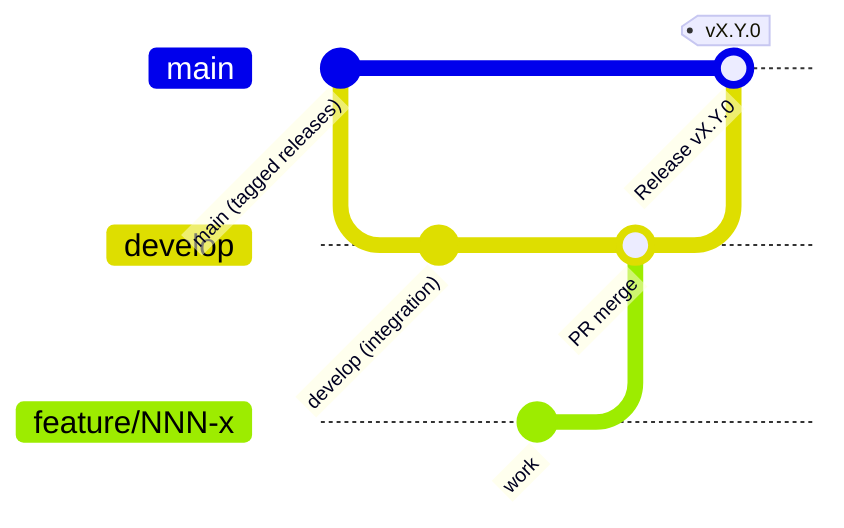

# Branching, commits & pull requests

The git model Corex uses, with the exact commands. The rules come from
[`COREX-FRAMEWORK.md §19`](../../../COREX-FRAMEWORK.md) and [`COREX-WORKING-GUIDE.md`](../../../COREX-WORKING-GUIDE.md).

## The branching model (git-flow-lite)



- **`main`** — production-ready, **tagged releases only**. Environments deploy a tag, never a branch.
- **`develop`** — the integration branch; features merge here first.
- **`feature/NNN-name`** — short-lived, branched off `develop`, one per spec/feature.

Start a feature:

```bash
git checkout develop && git pull
git checkout -b feature/029-my-thing develop
```

```text
Switched to a new branch 'feature/029-my-thing'
```

## Commits — Conventional Commits

Every commit message follows [Conventional Commits](https://www.conventionalcommits.org/): a `type(scope):`
prefix and an imperative summary.

```bash
git commit -m "feat(forms): add a date field type"
```

```text
[feature/029-my-thing abc1234] feat(forms): add a date field type
```

Common types used in this repo: `feat`, `fix`, `docs`, `refactor`, `test`, `build`, `chore`. The scope is the
module (`core`, `forms`, `blocks`, `config`, `ui`, `cli`, …). End AI-assisted commits with the
`Co-Authored-By:` trailer the project uses.

## Pull requests

1. Push your branch and open a PR **into `develop`**:

   ```bash
   git push -u origin feature/029-my-thing
   gh pr create --base develop --title "feat(forms): date field type" --body "..."
   ```

   ```text
   https://github.com/MustafaShaaban/corex/pull/30
   ```

2. **CI must be green** — the [quality gates](./quality-gates.md) run automatically
   ([`.github/workflows/ci.yml`](../../../.github/workflows/ci.yml)).
3. **Review**: the PR describes what changed and why; it links its spec; it shows tests passing. A reviewer
   checks it against the constitution (architecture, tokens, security, i18n/RTL) and the Definition of Done.
4. **Merge** into `develop` once approved + green. Releases are cut by merging `develop` → `main` and tagging
   `vX.Y.0` (with a `CHANGELOG.md` entry).

## Releasing (maintainers)

```bash
git checkout main && git merge --no-ff develop -m "Release v0.20.0 — ..."
git tag -a v0.20.0 -m "Corex v0.20.0" && git push origin main v0.20.0
```

```text
 * [new tag]  v0.20.0 -> v0.20.0
```

## See also

- [The Spec Kit loop](./spec-kit.md) · [Quality gates](./quality-gates.md) ·
  [`COREX-FRAMEWORK.md §19`](../../../COREX-FRAMEWORK.md)
