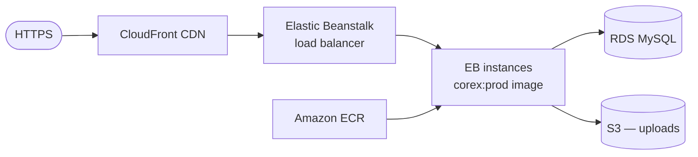

# Deploy to AWS Elastic Beanstalk (+ RDS, S3, CloudFront)

**Elastic Beanstalk** provisions and runs the app for you (load balancer, auto-scaling, health). This recipe
uses the Docker platform with the production image from the [Docker page](./docker.md), **RDS** for MySQL,
**S3** for WordPress uploads, and **CloudFront** as the CDN. Releases ship a **tag** with **immutable deploys**
(zero-downtime) and roll back to a previous application version instantly.

## Topology



## Before you start

### AWS CLI + EB CLI

The **AWS CLI** (`aws`) manages AWS resources; the **EB CLI** (`eb`) drives Elastic Beanstalk.

- Windows: `msiexec /i https://awscli.amazonaws.com/AWSCLIV2.msi` then `pip install awsebcli`
- Linux: `sudo apt install -y awscli && pip install awsebcli`
- macOS: `brew install awscli awsebcli`

```bash
aws --version && eb --version
```

```text
aws-cli/2.15.0 ...
EB CLI 3.20.10 ...
```

Configure credentials:

```bash
aws configure
```

```text
AWS Access Key ID [None]: ...
Default region name [None]: eu-west-1
```

## Step 1 — Database (RDS) and uploads bucket (S3)

```bash
aws rds create-db-instance --db-instance-identifier corex-db --engine mysql --engine-version 8.0 \
  --db-instance-class db.t3.micro --allocated-storage 20 \
  --master-username corexadmin --master-user-password "<DB_PW>" --db-name corex --no-publicly-accessible
aws s3 mb s3://corex-uploads
```

```text
{ "DBInstance": { "DBInstanceStatus": "creating", ... } }
make_bucket: corex-uploads
```

> WordPress **uploads** must live on S3 (via an offload plugin), not in the immutable container image.

## Step 2 — Push the production image to ECR

```bash
aws ecr create-repository --repository-name corex
aws ecr get-login-password | docker login --username AWS --password-stdin <ACCT>.dkr.ecr.eu-west-1.amazonaws.com
git checkout v0.19.0
docker build --target prod -t <ACCT>.dkr.ecr.eu-west-1.amazonaws.com/corex:v0.19.0 .
docker push <ACCT>.dkr.ecr.eu-west-1.amazonaws.com/corex:v0.19.0
```

```text
v0.19.0: digest: sha256:... size: ...
```

## Step 3 — Initialise + create the environment

A `Dockerrun.aws.json` tells Beanstalk which image to run:

```json
{
  "AWSEBDockerrunVersion": "1",
  "Image": { "Name": "<ACCT>.dkr.ecr.eu-west-1.amazonaws.com/corex:v0.19.0" },
  "Ports": [ { "ContainerPort": 9000 } ]
}
```

```bash
eb init corex --platform docker --region eu-west-1
eb create corex-prod --envvars WORDPRESS_DB_HOST=corex-db...rds.amazonaws.com,WORDPRESS_DB_NAME=corex,WORDPRESS_DB_USER=corexadmin
```

```text
Environment details for: corex-prod
  Status: Ready   Health: Green
  CNAME: corex-prod.eu-west-1.elasticbeanstalk.com
```

## Step 4 — Secrets, HTTPS, CDN

- **Secrets**: store `DB_PW` in **AWS Systems Manager Parameter Store** (SecureString) and reference it from the
  environment, rather than putting it in plain env vars:

  ```bash
  aws ssm put-parameter --name /corex/db-password --type SecureString --value "<DB_PW>"
  ```

  ```text
  { "Version": 1, "Tier": "Standard" }
  ```

- **HTTPS**: request an ACM certificate and attach it to the EB load balancer's HTTPS listener.
- **CDN**: create a CloudFront distribution with the EB environment as the origin.

## Step 5 — Zero-downtime deploys + rollback

Configure **immutable** deployments (new instances built and health-checked before the swap):

```bash
eb deploy corex-prod
```

```text
INFO: Environment update completed successfully.
```

**Rollback** to the previous application version (instant — no rebuild):

```bash
eb appversion --delete <bad-version>     # or:
aws elasticbeanstalk update-environment --environment-name corex-prod --version-label <previous-tag>
```

```text
{ "Status": "Updating", "VersionLabel": "v0.18.0" }
```

## Step 6 — Backups

```bash
aws rds create-db-snapshot --db-instance-identifier corex-db --db-snapshot-identifier corex-$(date +%F)
```

```text
{ "DBSnapshot": { "Status": "creating", ... } }
```

RDS automated backups + point-in-time restore are enabled by default; S3 uploads are versioned with bucket
versioning.

## Step 7 — CI/CD (Azure Pipelines)

```yaml
trigger: { tags: { include: [ 'v*' ] } }
pool: { vmImage: 'ubuntu-latest' }
steps:
  - script: |
      aws ecr get-login-password | docker login --username AWS --password-stdin <ACCT>.dkr.ecr.eu-west-1.amazonaws.com
      docker build --target prod -t <ACCT>.dkr.ecr.eu-west-1.amazonaws.com/corex:$(Build.SourceBranchName) .
      docker push <ACCT>.dkr.ecr.eu-west-1.amazonaws.com/corex:$(Build.SourceBranchName)
      eb deploy corex-prod --label $(Build.SourceBranchName)
    env: { AWS_ACCESS_KEY_ID: $(awsKey), AWS_SECRET_ACCESS_KEY: $(awsSecret) }
```

```text
Job 'Deploy' succeeded
```

## Where to next

- [AWS EC2 + RDS](./aws-ec2-rds.md) (manual control) ·
  [Secrets, backups, rollback, zero-downtime](./secrets-backups-zero-downtime.md) · [CI/CD](./ci-cd.md)

## See also

- [Docker production image](./docker.md#the-production-image) · [`COREX-FRAMEWORK.md §19`](../../../COREX-FRAMEWORK.md)
