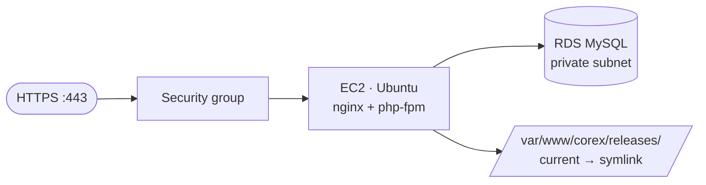

# Deploy to AWS EC2 + RDS (manual)

This is the **manual** AWS path: an EC2 Ubuntu instance running nginx + php-fpm, with the database on **RDS**.
The on-instance stack install, atomic release directories, TLS, backups, and rollback are the **same** as the
[Azure VM recipe](./azure-vm.md) — this page covers the AWS-specific provisioning and points you there for the
shared steps.

## Topology



## Before you start

The **AWS CLI** (`aws`) — install + `aws configure` as in the
[Beanstalk recipe → Before you start](./aws-beanstalk.md#before-you-start).

```bash
aws sts get-caller-identity
```

```text
{ "Account": "...", "Arn": "arn:aws:iam::...:user/you" }
```

## Step 1 — Database (RDS, private)

```bash
aws rds create-db-instance --db-instance-identifier corex-db --engine mysql --engine-version 8.0 \
  --db-instance-class db.t3.micro --allocated-storage 20 \
  --master-username corexadmin --master-user-password "<DB_PW>" --db-name corex --no-publicly-accessible
```

```text
{ "DBInstance": { "DBInstanceStatus": "creating", "Endpoint": null } }
```

Wait for it, then note the endpoint:

```bash
aws rds describe-db-instances --db-instance-identifier corex-db --query "DBInstances[0].Endpoint.Address" --output text
```

```text
corex-db.abcdef.eu-west-1.rds.amazonaws.com
```

## Step 2 — EC2 instance + security group

```bash
aws ec2 create-security-group --group-name corex-sg --description "Corex web"
aws ec2 authorize-security-group-ingress --group-name corex-sg --protocol tcp --port 22 --cidr <YOUR_IP>/32
aws ec2 authorize-security-group-ingress --group-name corex-sg --protocol tcp --port 80 --cidr 0.0.0.0/0
aws ec2 authorize-security-group-ingress --group-name corex-sg --protocol tcp --port 443 --cidr 0.0.0.0/0
aws ec2 run-instances --image-id ami-<ubuntu-22.04> --instance-type t3.small \
  --key-name <your-keypair> --security-groups corex-sg
```

```text
{ "Instances": [ { "InstanceId": "i-0abc...", "State": { "Name": "pending" } } ] }
```

> Allow the EC2 security group to reach RDS on port 3306 (add the EC2 SG to the RDS SG's inbound rules). Keep
> RDS **not publicly accessible**.

SSH in (public IP from `describe-instances`):

```bash
ssh -i <your-keypair>.pem ubuntu@<EC2_PUBLIC_IP>
```

```text
Welcome to Ubuntu 22.04 LTS ...
```

## Step 3 — Install the stack + deploy a release

The on-instance steps are **identical** to the Azure VM recipe — follow these sections there, using the RDS
endpoint from Step 1 as the database host (not `localhost`):

1. [Install the stack + firewall](./azure-vm.md#step-2--install-the-stack--firewall) (use AWS security groups
   for the firewall; UFW is optional).
2. [Install WP-CLI](./azure-vm.md#step-3--database--wp-cli) (the database already exists on RDS — skip the local
   `CREATE DATABASE`).
3. [Deploy a release into an atomic directory](./azure-vm.md#step-4--deploy-a-release-into-an-atomic-directory) —
   in `wp config create`, set `--dbhost=corex-db.abcdef.eu-west-1.rds.amazonaws.com`.
4. [nginx site + TLS (Certbot)](./azure-vm.md#step-5--nginx-site--tls-certbot).

```bash
# in wp config create on the instance:
sudo wp config create --path=wp --dbname=corex --dbuser=corexadmin --dbpass='<DB_PW>' \
  --dbhost=corex-db.abcdef.eu-west-1.rds.amazonaws.com --dbprefix=cx_
```

```text
Success: Generated 'wp-config.php' file.
```

**Zero-downtime + rollback** work exactly as in the Azure VM recipe (flip the `current` symlink between
`releases/<tag>` directories).

## Step 4 — Backups

- **Database**: RDS automated backups + on-demand snapshots
  (`aws rds create-db-snapshot --db-instance-identifier corex-db --db-snapshot-identifier corex-$(date +%F)`).
- **Uploads**: sync `wp-content/uploads` to S3 on a cron, or offload uploads to S3 with a plugin.

```bash
aws s3 sync /var/www/corex/current/wp-content/uploads s3://corex-uploads/
```

```text
upload: ./uploads/2026/06/img.png to s3://corex-uploads/2026/06/img.png
```

## Step 5 — CI/CD

SSH-deploy from Azure Pipelines exactly as in the
[Azure VM CI/CD step](./azure-vm.md#step-7--cicd-azure-pipelines-ssh-deploy), targeting the EC2 host.

## Where to next

- [AWS Elastic Beanstalk](./aws-beanstalk.md) (managed alternative) ·
  [Secrets, backups, rollback, zero-downtime](./secrets-backups-zero-downtime.md)

## See also

- [Azure VM recipe](./azure-vm.md) (the shared LEMP + atomic-release flow) · [Linux dev setup](../00-getting-started/linux.md)
