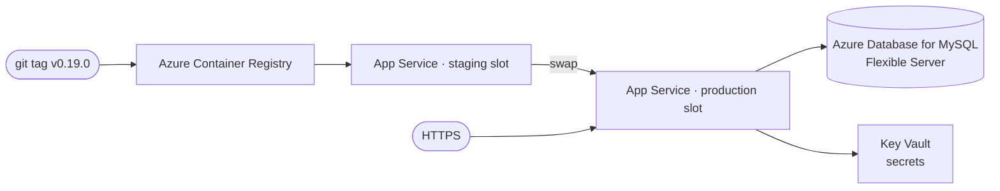

# Deploy to Azure App Service (containers)

This recipe runs Corex on **Azure App Service for Containers**, using the production image from the
[Docker page](./docker.md), a managed MySQL database, Key Vault for secrets, and a **staging slot** for
zero-downtime releases. Every deploy ships a **release tag** (per [`COREX-FRAMEWORK.md §19`](../../../COREX-FRAMEWORK.md)).

> Assumes you have an Azure subscription with permission to create resources.

## Readiness profile

| Field | Value |
|---|---|
| Profile | `azure-container` |
| Package shape | Production Docker image deployed to Azure App Service for Containers |
| Build commands | `docker build --target prod -t corex:prod .`; `az acr build`; `az webapp config container set` |
| Dependencies | Docker, Azure CLI, Azure Container Registry, Azure Database for MySQL |
| Secrets | Azure credentials, registry credentials, database credentials, Key Vault secrets |
| Blocker | Requires live Azure subscription, App Service settings, and repository secret verification |

## Topology



## Before you start

### Azure CLI

The **Azure CLI** (`az`) creates and manages Azure resources from your terminal.

- Windows: `winget install Microsoft.AzureCLI`
- Linux: `curl -sL https://aka.ms/InstallAzureCLIDeb | sudo bash`
- macOS: `brew install azure-cli`

```bash
az version
```

```text
{ "azure-cli": "2.58.0", ... }
```

Sign in:

```bash
az login
```

```text
[ { "name": "My Subscription", "state": "Enabled", ... } ]
```

## Step 1 — Provision the resources

```bash
az group create --name corex-rg --location westeurope

# Container registry (holds the production image)
az acr create --resource-group corex-rg --name corexacr --sku Basic --admin-enabled true

# MySQL Flexible Server + the corex database
az mysql flexible-server create --resource-group corex-rg --name corex-db \
  --admin-user corexadmin --admin-password "<STRONG_PASSWORD>" \
  --tier Burstable --sku-name Standard_B1ms --version 8.0 --yes
az mysql flexible-server db create --resource-group corex-rg --server-name corex-db --database-name corex

# App Service plan (Linux) + the web app (placeholder image for now)
az appservice plan create --resource-group corex-rg --name corex-plan --is-linux --sku B1
az webapp create --resource-group corex-rg --plan corex-plan --name corex-app \
  --deployment-container-image-name nginx
```

```text
{ "provisioningState": "Succeeded", "name": "corex-app", ... }
```

## Step 2 — Build and push the production image (from a tag)

```bash
git checkout v0.19.0
az acr build --registry corexacr --image corex:v0.19.0 --file Dockerfile --target prod .
```

```text
Run ID: ... was successful after ...
Successfully pushed image 'corexacr.azurecr.io/corex:v0.19.0'
```

## Step 3 — Configure App Settings + secrets (Key Vault)

Store secrets in Key Vault and reference them — never paste them into App Settings directly:

```bash
az keyvault create --resource-group corex-rg --name corex-kv
az keyvault secret set --vault-name corex-kv --name db-password --value "<STRONG_PASSWORD>"
az webapp identity assign --resource-group corex-rg --name corex-app
# grant the app's identity 'get' on secrets (see Key Vault access policies), then:
az webapp config appsettings set --resource-group corex-rg --name corex-app --settings \
  WORDPRESS_DB_HOST="corex-db.mysql.database.azure.com" \
  WORDPRESS_DB_NAME="corex" \
  WORDPRESS_DB_USER="corexadmin" \
  WORDPRESS_DB_PASSWORD="@Microsoft.KeyVault(SecretUri=https://corex-kv.vault.azure.net/secrets/db-password/)" \
  WEBSITES_PORT="9000"
```

```text
[ { "name": "WORDPRESS_DB_HOST", ... }, ... ]
```

## Step 4 — Point the web app at the image + enable HTTPS

```bash
az webapp config container set --resource-group corex-rg --name corex-app \
  --docker-custom-image-name corexacr.azurecr.io/corex:v0.19.0 \
  --docker-registry-server-url https://corexacr.azurecr.io
az webapp update --resource-group corex-rg --name corex-app --https-only true
```

```text
{ "httpsOnly": true, ... }
```

App Service serves a managed TLS certificate on `*.azurewebsites.net` automatically; for a custom domain, add
it with `az webapp config hostname add` and bind a managed certificate.

## Step 5 — Zero-downtime releases with a staging slot

```bash
az webapp deployment slot create --resource-group corex-rg --name corex-app --slot staging

# deploy the NEW tag to staging, verify it, then swap (the swap is the zero-downtime cutover)
az webapp config container set --resource-group corex-rg --name corex-app --slot staging \
  --docker-custom-image-name corexacr.azurecr.io/corex:v0.20.0 \
  --docker-registry-server-url https://corexacr.azurecr.io
az webapp deployment slot swap --resource-group corex-rg --name corex-app --slot staging
```

```text
Swap operation 'corex-app' completed.
```

**Rollback** = swap back (instant) or re-point production at the previous tag:

```bash
az webapp deployment slot swap --resource-group corex-rg --name corex-app --slot staging   # swaps prod ↔ staging again
```

## Step 6 — Backups

```bash
# database: scheduled by the Flexible Server (point-in-time restore). On-demand logical dump:
az mysql flexible-server execute --name corex-db --admin-user corexadmin --admin-password "<PW>" \
  --querytext "SELECT 1"    # connectivity check; use mysqldump from a jump host for logical backups
# app: enable App Service backups (uploads/config) to a storage account:
az webapp config backup update --resource-group corex-rg --webapp-name corex-app \
  --container-url "<SAS_URL>" --frequency 1d --retain-one true
```

```text
{ "enabled": true, "frequencyInterval": 1, ... }
```

> WordPress **uploads** are state — store them on Azure Blob (via an offload plugin) or a mounted share, not
> inside the container (the image is immutable; a new tag would lose them).

## Step 7 — CI/CD (Azure Pipelines)

`azure-pipelines.yml` (triggered on a tag) builds + pushes the image and deploys to staging, then swaps:

```yaml
trigger:
  tags:
    include: [ 'v*' ]
pool: { vmImage: 'ubuntu-latest' }
steps:
  - task: AzureCLI@2
    inputs:
      azureSubscription: 'corex-sc'
      scriptType: bash
      scriptLocation: inlineScript
      inlineScript: |
        az acr build --registry corexacr --image corex:$(Build.SourceBranchName) --target prod .
        az webapp config container set -g corex-rg -n corex-app --slot staging \
          --docker-custom-image-name corexacr.azurecr.io/corex:$(Build.SourceBranchName) \
          --docker-registry-server-url https://corexacr.azurecr.io
        az webapp deployment slot swap -g corex-rg -n corex-app --slot staging
```

```text
Job 'Deploy' succeeded
```

> The repo's own gate stays **GitHub Actions** (`.github/workflows/ci.yml`) for lint+test; Azure Pipelines here
> is the **deployment** pipeline (DECISIONS #62 — repo-CI choice tracked separately).

## Where to next

- [Azure VM](./azure-vm.md) (if you want full control instead of PaaS) ·
  [Secrets, backups, rollback, zero-downtime](./secrets-backups-zero-downtime.md) · [CI/CD](./ci-cd.md)

## See also

- [Docker production image](./docker.md#the-production-image) · [`COREX-FRAMEWORK.md §19`](../../../COREX-FRAMEWORK.md)
