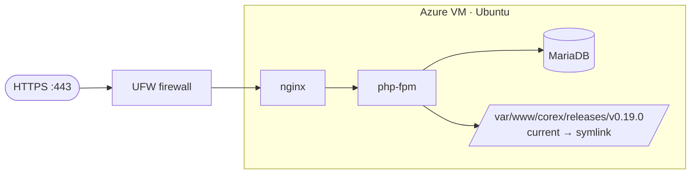

# Deploy to an Azure VM (Ubuntu + nginx + php-fpm + MariaDB)

This recipe gives you **full control**: an Ubuntu VM running nginx + php-fpm + MariaDB, TLS via Certbot, a UFW
firewall, **atomic release directories** for zero-downtime + instant rollback, and backups. You deploy a
**release tag**.

## Readiness profile

| Field | Value |
|---|---|
| Profile | `standard` or `full` |
| Package shape | Tagged Corex release in atomic release directories with current symlink |
| Build commands | `composer validate --no-check-publish`; `composer test`; `npm run build`; optional `npm run test:js` |
| Dependencies | PHP 8.3 FPM, nginx, MariaDB, WP-CLI, Node 20+ for build hosts |
| Secrets | Database credentials, mail credentials, optional captcha keys, WordPress salts |
| Blocker | Live VM provisioning, service health, TLS, and backup restore must be verified on the target VM |

## Topology



## Step 1 — Create the VM + open ports

```bash
az group create --name corex-rg --location westeurope
az vm create --resource-group corex-rg --name corex-vm --image Ubuntu2204 \
  --admin-username azureuser --generate-ssh-keys --size Standard_B2s
az vm open-port --resource-group corex-rg --name corex-vm --port 80 --priority 100
az vm open-port --resource-group corex-rg --name corex-vm --port 443 --priority 110
```

```text
{ "publicIpAddress": "20.10.x.x", "powerState": "VM running", ... }
```

SSH in (use the IP from the output above):

```bash
ssh azureuser@20.10.x.x
```

```text
Welcome to Ubuntu 22.04 LTS ...
```

## Step 2 — Install the stack + firewall

```bash
sudo apt update
sudo apt install -y nginx mariadb-server php8.3-fpm php8.3-mysql php8.3-curl php8.3-mbstring php8.3-xml php8.3-zip php8.3-gd git unzip ufw
sudo ufw allow OpenSSH && sudo ufw allow 'Nginx Full' && sudo ufw --force enable
```

```text
Firewall is active and enabled on system startup
```

Verify services:

```bash
systemctl is-active nginx mariadb php8.3-fpm
```

```text
active
active
active
```

## Step 3 — Database + WP-CLI

```bash
sudo mysql -e "CREATE DATABASE corex; CREATE USER 'corex'@'localhost' IDENTIFIED BY '<DB_PW>'; GRANT ALL ON corex.* TO 'corex'@'localhost'; FLUSH PRIVILEGES;"
curl -O https://raw.githubusercontent.com/wp-cli/builds/gh-pages/phar/wp-cli.phar
chmod +x wp-cli.phar && sudo mv wp-cli.phar /usr/local/bin/wp
```

```text
(no output on success)
```

## Step 4 — Deploy a release into an atomic directory

Deploy each tag into its own `releases/<tag>` directory and flip a `current` symlink — the flip is the
zero-downtime cutover, and the previous directory is your instant rollback.

```bash
sudo mkdir -p /var/www/corex/releases
cd /var/www/corex/releases
sudo git clone --branch v0.19.0 --depth 1 https://github.com/MustafaShaaban/corex.git v0.19.0
cd v0.19.0
sudo composer install --no-dev --optimize-autoloader
sudo npm ci && sudo npm run build

# WordPress core + the monorepo symlinks (as in the Linux dev guide), then install:
sudo wp core download --path=wp --skip-content
sudo wp config create --path=wp --dbname=corex --dbuser=corex --dbpass='<DB_PW>' --dbprefix=cx_
sudo wp core install --path=wp --url=https://corex.example.com --title=Corex \
  --admin_user=admin --admin_email=you@example.com --admin_password='<ADMIN_PW>' --skip-email
sudo mkdir -p wp/wp-content/themes wp/wp-content/plugins
sudo ln -sfn "$(pwd)/theme" wp/wp-content/themes/corex
for d in plugins/* addons/*; do sudo ln -sfn "$(pwd)/$d" "wp/wp-content/plugins/$(basename "$d")"; done
sudo wp theme activate corex --path=wp
sudo wp plugin activate corex-core corex-blocks corex-config corex-forms --path=wp

# flip current → this release (atomic)
sudo ln -sfn /var/www/corex/releases/v0.19.0/wp /var/www/corex/current
sudo chown -R www-data:www-data /var/www/corex
```

```text
Success: WordPress installed successfully.
Success: Switched to 'Corex' theme.
```

**Rollback** = point `current` back at the previous release and reload:

```bash
sudo ln -sfn /var/www/corex/releases/v0.18.0/wp /var/www/corex/current && sudo systemctl reload nginx
```

## Step 5 — nginx site + TLS (Certbot)

```nginx
# /etc/nginx/sites-available/corex
server {
    server_name corex.example.com;
    root /var/www/corex/current;
    index index.php;
    location / { try_files $uri $uri/ /index.php?$args; }
    location ~ \.php$ {
        include snippets/fastcgi-php.conf;
        fastcgi_pass unix:/run/php/php8.3-fpm.sock;
    }
}
```

```bash
sudo ln -s /etc/nginx/sites-available/corex /etc/nginx/sites-enabled/corex
sudo nginx -t && sudo systemctl reload nginx
sudo apt install -y certbot python3-certbot-nginx
sudo certbot --nginx -d corex.example.com --non-interactive --agree-tos -m you@example.com
```

```text
Congratulations! You have successfully enabled HTTPS on https://corex.example.com
```

## Step 6 — Backups (database + uploads, nightly)

```bash
# /etc/cron.daily/corex-backup
#!/bin/bash
mysqldump corex | gzip > /var/backups/corex-$(date +%F).sql.gz
tar czf /var/backups/corex-uploads-$(date +%F).tar.gz /var/www/corex/current/wp-content/uploads
find /var/backups -name 'corex-*' -mtime +14 -delete
```

```bash
sudo chmod +x /etc/cron.daily/corex-backup && sudo /etc/cron.daily/corex-backup
```

```text
(creates /var/backups/corex-YYYY-MM-DD.sql.gz)
```

## Step 7 — CI/CD (Azure Pipelines, SSH deploy)

```yaml
trigger:
  tags: { include: [ 'v*' ] }
pool: { vmImage: 'ubuntu-latest' }
steps:
  - task: SSH@0
    inputs:
      sshEndpoint: 'corex-vm'
      runOptions: inline
      inline: |
        cd /var/www/corex/releases
        sudo git clone --branch $(Build.SourceBranchName) --depth 1 https://github.com/MustafaShaaban/corex.git $(Build.SourceBranchName)
        cd $(Build.SourceBranchName) && sudo composer install --no-dev && sudo npm ci && sudo npm run build
        # ... wp setup as in Step 4 ...
        sudo ln -sfn /var/www/corex/releases/$(Build.SourceBranchName)/wp /var/www/corex/current
        sudo systemctl reload nginx
```

```text
Job 'Deploy' succeeded
```

## Where to next

- [Azure App Service](./azure-app-service.md) (managed PaaS alternative) ·
  [Secrets, backups, rollback, zero-downtime](./secrets-backups-zero-downtime.md)

## See also

- [Linux dev setup](../00-getting-started/linux.md) (the same WP-CLI + symlink flow) ·
  [`COREX-FRAMEWORK.md §19`](../../../COREX-FRAMEWORK.md)
