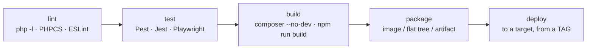

# CI/CD — pipeline stages and per-target wiring

Corex separates **two** automated pipelines, and it matters which is which:

1. **The repository quality gate** — runs on every push/PR to `main`/`develop`. This is **GitHub Actions**
   ([`.github/workflows/ci.yml`](../../../.github/workflows/ci.yml)): `composer validate` → `php -l` → `composer
   test`. It decides whether code may merge. It does **not** deploy.
2. **The deployment pipeline** — runs on a **release tag** (`v*`). This builds the artifact and ships it to a
   target. The deployment recipes use **Azure Pipelines** (`azure-pipelines.yml`); the per-target steps live in
   each recipe.

> The repo gate staying GitHub Actions while deployment uses Azure Pipelines is a tracked decision
> (DECISIONS #62). You can run both pipelines on one system if you prefer — the **stages** below are the same
> regardless of the runner.

A third workflow, **Docs** ([`.github/workflows/docs.yml`](../../../.github/workflows/docs.yml)), runs on push
to `main`: it regenerates the per-class reference from source (`composer docs:generate`, a headless equivalent
of `wp corex docs:generate` that needs no WordPress) and builds the docs site, so the published reference can
never drift from the code. Enable GitHub Pages to publish the built artifact (see the comment in that file).

## Pipeline stages

Per [`COREX-FRAMEWORK.md §19`](../../../COREX-FRAMEWORK.md), a full pipeline is:

- **lint / test** = the quality gate (GitHub Actions today).
- **build / package / deploy** = the deployment pipeline (per target).

## Deploy from a tag, never a branch

Environments deploy a **tag**: staging ships `v1.4.0-rc.1`, production ships `v1.4.0`. The tag is the single
record of what is live. Every recipe's deploy step is triggered by `trigger: { tags: { include: ['v*'] } }`.

## Per-target deploy wiring

| Target | Package | Deploy step (in its recipe) |
|---|---|---|
| [Docker](./docker.md) | `docker build --target prod` | push image to a registry |
| [Azure App Service](./azure-app-service.md#step-7--cicd-azure-pipelines) | image → ACR | set container image on staging slot → **swap** |
| [Azure VM](./azure-vm.md#step-7--cicd-azure-pipelines-ssh-deploy) | git tag + build on host | clone tag into `releases/<tag>` → flip `current` symlink |
| [AWS Beanstalk](./aws-beanstalk.md#step-7--cicd-azure-pipelines) | image → ECR | `eb deploy` (immutable) |
| [AWS EC2 + RDS](./aws-ec2-rds.md#step-5--cicd) | git tag + build on host | SSH deploy + symlink flip |
| [cPanel](./cpanel-shared-hosting.md#step-8--cicd-build--sftp) | flat `dist/` tree | SFTP upload |

## Secrets in CI

Never hard-code secrets in a pipeline file. Use the runner's secret store (GitHub Actions secrets / Azure
Pipelines variable groups backed by Key Vault) and the cloud's secret manager at runtime — see
[Secrets, backups, rollback, zero-downtime](./secrets-backups-zero-downtime.md).

## See also

- [`.github/workflows/ci.yml`](../../../.github/workflows/ci.yml) (the repo gate) ·
  [Team workflow → quality gates](../04-team-workflow/) · [`COREX-FRAMEWORK.md §19`](../../../COREX-FRAMEWORK.md)
