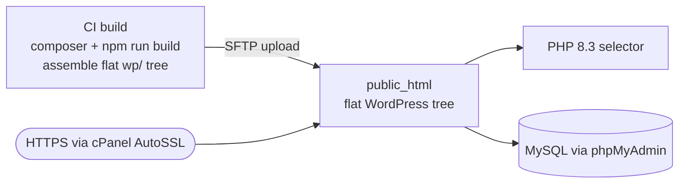

# Deploy to cPanel shared hosting (no symlinks)

Shared hosting is the **constrained** target: typically **no symlinks**, no shell/WP-CLI, no Docker — only FTP,
a PHP selector, phpMyAdmin, and a file manager. The trick is to **build the site into a single flat WordPress
tree** (the Corex source **copied**, not symlinked, into `wp-content`) and upload that.

> **The constraint, stated plainly:** the dev environments map the monorepo into WordPress with junctions
> (Windows) or symlinks (Linux/macOS). Shared hosting cannot do that. So the deploy artifact must already
> contain `wp-content/themes/corex/` and `wp-content/plugins/*/` as **real folders**.

## Topology



## Step 1 — Build the deployable tree (on your machine or CI)

Produce a self-contained WordPress directory with the Corex source **copied** in. This mirrors what the
production Docker image does with `COPY`.

```bash
git checkout v0.19.0
composer install --no-dev --optimize-autoloader
npm ci && npm run build

# assemble a flat tree in ./dist
wp core download --path=dist --skip-content --locale=en_US
mkdir -p dist/wp-content/themes/corex dist/wp-content/plugins
cp -r theme/.            dist/wp-content/themes/corex/
cp -r plugins/*          dist/wp-content/plugins/
cp -r addons/*           dist/wp-content/plugins/
cp -r vendor             dist/vendor
```

```text
(dist/ now contains a complete WordPress with Corex copied into wp-content)
```

## Step 2 — Create the database (cPanel → MySQL Databases)

1. In cPanel → **MySQL Databases**, create a database (e.g. `acct_corex`) and a user, and **add the user to the
   database** with all privileges. Note the names — cPanel prefixes them with your account.

## Step 3 — Set PHP 8.3 (cPanel → Select PHP Version / MultiPHP)

1. cPanel → **Select PHP Version** (or MultiPHP Manager) → choose **8.3** for the domain.
2. Enable the extensions WordPress needs: `mysqli`, `mbstring`, `curl`, `gd`, `zip`, `xml`.

Verify via a one-line probe you upload then delete:

```php
<?php echo PHP_VERSION, PHP_EOL; // upload as phpcheck.php, load it, then delete it
```

```text
8.3.6
```

## Step 4 — Upload the tree (SFTP/FTP)

Upload the **contents** of `dist/` into `public_html` (or the domain's document root) with an SFTP client
(FileZilla, WinSCP). SFTP is preferred over plain FTP (it is encrypted).

```bash
# example with lftp (mirror the local dist/ to the remote public_html)
lftp -u <ftp_user>,<ftp_pass> sftp://<host> -e "mirror -R dist /public_html; quit"
```

```text
Total: 12 directories, 1843 files transferred
```

## Step 5 — Configure WordPress (wp-config.php by hand)

There is no WP-CLI, so create `public_html/wp-config.php` from `wp-config-sample.php` and fill in the cPanel
database details:

```php
define( 'DB_NAME', 'acct_corex' );
define( 'DB_USER', 'acct_corexuser' );
define( 'DB_PASSWORD', '<DB_PW>' );
define( 'DB_HOST', 'localhost' );
$table_prefix = 'cx_';
```

Then load the site URL in a browser to run the WordPress installer, **or** import a database you exported
elsewhere (next step).

## Step 6 — Import a database (phpMyAdmin), if migrating

If you are moving an existing Corex site, export its DB to a `.sql` file and import it:

1. cPanel → **phpMyAdmin** → select `acct_corex` → **Import** → choose your `.sql` file → **Go**.
2. Update the site URL rows if the domain changed (search-replace `siteurl`/`home` in `cx_options`).

```sql
UPDATE cx_options SET option_value='https://corex.example.com' WHERE option_name IN ('siteurl','home');
```

```text
2 rows affected.
```

## Step 7 — HTTPS, backups, rollback

- **HTTPS**: cPanel → **SSL/TLS Status** → run **AutoSSL** for the domain.
- **Backups**: cPanel → **Backup** → download a full or partial (Home Directory + MySQL) backup on a schedule;
  many hosts also offer JetBackup with daily restore points.
- **Rollback**: keep the **previous** `dist/` upload as a dated folder (e.g. `public_html_v0.18.0`); to roll
  back, repoint the domain's document root to it (cPanel → **Domains**) or re-upload the previous tree, and
  restore the matching database backup.

> Shared hosting has **no atomic swap**. Deploy during low traffic, and keep the previous tree + a DB backup so
> a rollback is "repoint + restore", not a rebuild.

## Step 8 — CI/CD (build + SFTP)

```yaml
trigger: { tags: { include: [ 'v*' ] } }
pool: { vmImage: 'ubuntu-latest' }
steps:
  - script: |
      composer install --no-dev --optimize-autoloader
      npm ci && npm run build
      wp core download --path=dist --skip-content
      mkdir -p dist/wp-content/themes/corex dist/wp-content/plugins
      cp -r theme/. dist/wp-content/themes/corex/ && cp -r plugins/* addons/* dist/wp-content/plugins/ && cp -r vendor dist/vendor
  - task: FtpUpload@2
    inputs: { credentialsOption: inputs, serverUrl: 'sftp://<host>', username: $(ftpUser), password: $(ftpPass), rootDirectory: 'dist', remoteDirectory: '/public_html', clean: false }
```

```text
Job 'Deploy' succeeded
```

## Where to next

- A more capable host? Use [Azure VM](./azure-vm.md) or [AWS EC2 + RDS](./aws-ec2-rds.md) for symlinked atomic
  releases. · [Secrets, backups, rollback, zero-downtime](./secrets-backups-zero-downtime.md)

## See also

- [Docker production image](./docker.md#the-production-image) (the same "copy source into wp-content" model) ·
  [CI/CD](./ci-cd.md)
