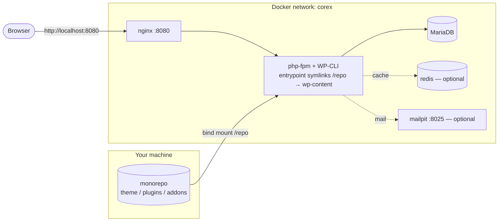
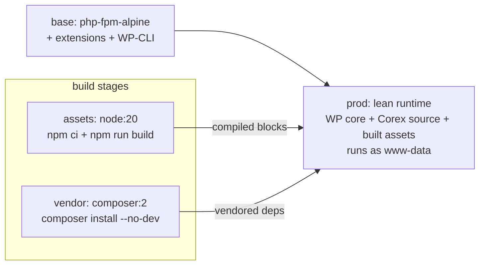

# Docker — development stack & production image

This page gives you two things: a **one-command development stack** (`docker compose`) with the Corex monorepo
mapped into WordPress, and a **multi-stage production image**. The files referenced here live at the repo root
([`docker-compose.yml`](../../../docker-compose.yml), [`Dockerfile`](../../../Dockerfile),
[`docker/`](../../../docker/)).

> **These services are a development convenience, not framework dependencies.** redis and mailpit are optional
> — Corex runs without them. Nothing here is added to `composer.json`/`package.json`. (Principle IX.)

## Before you start

### Docker

**Docker** runs the stack in containers. See the install steps in the
[wp-env guide → Docker](../00-getting-started/wp-env.md#docker), then verify:

```bash
docker --version && docker compose version
```

```text
Docker version 25.0.3, build ...
Docker Compose version v2.24.5
```

## The development stack

### Topology



The `php` container's [entrypoint](../../../docker/php/entrypoint.sh) reproduces the native setup **inside the
container**: it downloads WordPress core into a volume, configures and installs it, **symlinks** the monorepo
(`theme/`, `plugins/*`, `addons/*`) into `wp-content` — the container analogue of the Windows junctions — and
activates the theme + framework plugins.

### Bring it up

```bash
docker compose up -d --build
```

```text
[+] Running 5/5
 ✔ Container corex-db-1     Healthy
 ✔ Container corex-php-1    Started
 ✔ Container corex-web-1    Started
 ✔ Container corex-cache-1  Started
 ✔ Container corex-mail-1   Started
```

The first run builds the image and bootstraps WordPress (a few minutes). Then:

- Site: **http://localhost:8080** · Admin: **/wp-admin/** (`admin` / `changeme`)
- Mail catcher (every email the site sends): **http://localhost:8025**

### Everyday commands

Run WP-CLI / `wp corex` commands inside the `php` container:

```bash
docker compose exec php wp theme list --path=/var/www/html --allow-root
```

```text
| corex | active | none   | 0.1.0   |
```

Build the block assets (after editing block JS/SCSS):

```bash
docker compose exec php npm run build
```

```text
webpack compiled successfully
```

Run the tests **inside** the container:

```bash
docker compose exec php composer test
```

```text
Tests:    295 passed (829 assertions)
```

Reset the database to a fresh install:

```bash
docker compose exec php wp db reset --yes --path=/var/www/html --allow-root
```

```text
Success: Database reset.
```

Tear the stack down (keep data) / destroy it (remove volumes):

```bash
docker compose down            # stop + remove containers, keep volumes
docker compose down -v         # also delete the database + WP-core volumes
```

```text
[+] Running 6/6
 ✔ Container corex-web-1    Removed
 ...
 ✔ Network corex_corex      Removed
```

## The production image

The [`Dockerfile`](../../../Dockerfile) is multi-stage so the runtime image carries only what it needs:



Build and run it:

```bash
docker build --target prod -t corex:prod .
```

```text
 => exporting to image
 => => naming to docker.io/library/corex:prod
```

The `prod` target bakes WordPress core, the Corex source, the **compiled** block assets (from the `assets`
stage), and the **production** vendored dependencies (`composer install --no-dev`, from the `vendor` stage) into
the image, runs as the unprivileged `www-data` user, and contains no Node/dev tooling — matching the framework's
`build → package` release stages ([`COREX-FRAMEWORK.md §19`](../../../COREX-FRAMEWORK.md)).

> A production image still needs a database, a web server in front of php-fpm, and real secrets — those come
> from your host (see the [Azure](./azure-app-service.md) / [AWS](./aws-beanstalk.md) recipes and
> [secrets & backups](./secrets-backups-zero-downtime.md)). Deploy a **release tag**, never a branch.

## Where to next

- Deploy the image: [Azure](./azure-app-service.md) · [AWS](./aws-beanstalk.md) · [cPanel](./cpanel-shared-hosting.md)
- [Secrets, backups, rollback, zero-downtime](./secrets-backups-zero-downtime.md) · [CI/CD](./ci-cd.md)

## See also

- [`docker-compose.yml`](../../../docker-compose.yml) · [`Dockerfile`](../../../Dockerfile) ·
  [`docker/php/entrypoint.sh`](../../../docker/php/entrypoint.sh) ·
  [wp-env (the lighter Docker option)](../00-getting-started/wp-env.md)
