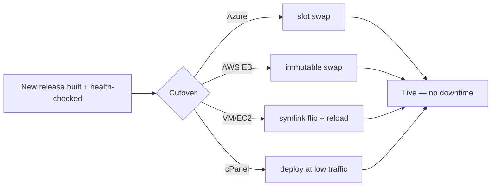

# Secrets, backups, rollback & zero-downtime

These practices apply to **every** target. The per-target recipes show the exact commands; this page is the
principles behind them, in one place.

## Secrets

**Never** commit a secret or paste it into a plain config field. The pattern is the same everywhere: store the
secret in a manager, reference it at runtime.

| Target | Where secrets live |
|---|---|
| Azure | **Key Vault** (App Settings use `@Microsoft.KeyVault(SecretUri=…)` references) |
| AWS | **Systems Manager Parameter Store** (SecureString) or Secrets Manager |
| VM / EC2 | a root-only `.env` outside the web root, or the cloud secret manager via the instance role |
| cPanel | `wp-config.php` outside version control, file permissions `600` |
| CI | the runner's secret store (GitHub Actions secrets / Azure Pipelines variable groups) |

What counts as a secret in Corex: the database password, any third-party API keys configured in
**corex-config** settings, SMTP credentials, and captcha secret keys. The framework reads them through the
[Config engine](../../README.md#what-lives-where) (`.env` → options → defaults), so they never need to be
hard-coded.

```bash
# .env on a VM (mode 600, outside the web root) — read by the Config engine
COREX_ENV=production
FEATURES_MAIL_QUEUE=1
```

```text
(loaded at boot; never committed — see .gitignore)
```

## Backups

Back up **two** things — they are separate:

1. **The database** — the source of truth for content and settings. Logical dump or managed snapshots:

   ```bash
   mysqldump corex | gzip > corex-$(date +%F).sql.gz      # VM / cPanel
   aws rds create-db-snapshot --db-instance-identifier corex-db --db-snapshot-identifier corex-$(date +%F)  # AWS
   ```

   ```text
   (a dated, restorable backup)
   ```

2. **The uploads** (`wp-content/uploads`) — user-uploaded media, which is **not** in the image or the repo.
   Store it on object storage (S3 / Azure Blob) or back it up on the same schedule as the database.

> Code is **not** a backup concern — it is rebuilt from a git **tag**. Only the database and uploads are state.

Test a restore periodically; a backup you have never restored is a hope, not a backup.

## Rollback

Rollback strategy follows the deploy strategy:

| Deploy model | Rollback |
|---|---|
| Slot swap (Azure App Service) | swap back — instant |
| Immutable (AWS Beanstalk) | re-point to the previous application version — instant |
| Atomic release dir (VM / EC2) | flip the `current` symlink to the previous `releases/<tag>` + reload |
| Flat upload (cPanel) | repoint the document root to the previous tree + restore the DB backup |

In every case you roll **code** back to the previous **tag**. If the new release ran a data migration, restore
the matching **database** backup too — code rollback alone is not enough when the schema changed.

## Zero-downtime

The goal: users never hit a half-deployed site. The mechanism per target:



The common rule: **build and verify the new release fully before it serves any traffic**, then cut over
atomically. Shared hosting (cPanel) is the exception — it has no atomic swap, so deploy during low traffic and
keep the previous tree ready for an immediate repoint.

## See also

- [CI/CD](./ci-cd.md) · the per-target recipes ([Azure](./azure-app-service.md) · [AWS](./aws-beanstalk.md) ·
  [VM](./azure-vm.md) · [cPanel](./cpanel-shared-hosting.md))
