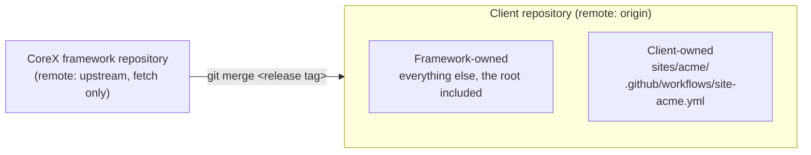

# Updating CoreX in a client site

A client site is built in its own repository. That repository is a copy of the CoreX framework
with the client's site beside it, and it takes each new CoreX release by **merging** it. This page
is how to set that up once, and how to take a release every time after.

Examples use the neutral **Acme** placeholder and the release tag `v1.2.3`. Substitute your client
and the release you are taking.

## How a client repository is put together



Every path in the repository belongs to one side or the other:

| Owner | Paths | Who changes them |
|---|---|---|
| **Client** | `sites/**` and `.github/workflows/site-*.yml` | You, freely. |
| **Framework** | Everything else — `plugins/`, `addons/`, `packages/`, `theme/`, `scripts/`, `tests/`, `docs/`, and every file at the repository root | A framework release, and nothing else. |

The two client-owned patterns are listed in `.github/repository-ownership.json`. The framework is
defined as *everything that is not on that list*, so a new framework directory is covered the day
it is added and a stray file at the root is not silently yours.

**The rule that keeps an update conflict-free: client work never edits a framework-owned path.** A
framework release never ships a file under `sites/`, so a merge cannot overwrite your site. The
only way to get a conflict is to have changed something the framework also changes.

**Two framework files a client repository may delete.** `.github/dependabot.yml` and
`.github/CODEOWNERS` act on whatever repository they are in, and neither can be told to act only
in the framework's. Left in place, Dependabot opens pull requests against the framework's
lockfiles every week — which a client must never merge, because that is drift — and CODEOWNERS
asks the framework's reviewer to review the client's work. `.github/repository-ownership.json`
lists both under `clientMayRemove`. Deleting one is not drift: the check prints `REMOVED` for it
and passes. Editing one still is.

That includes the root documents. `README.md`, `PROGRESS.md`, `DECISIONS.md` and `CHANGELOG.md` at
the root are the framework's. The client's own are in `sites/acme/`, generated for you. Design
handoffs, notes and anything else of the client's belong under `sites/acme/` too, which has its own
`.gitignore`.

## Create the client repository

Do this once per client.

### 1. Copy a CoreX release into a new repository

```bash
git clone --branch v1.2.3 https://github.com/MustafaShaaban/corex.git acme
cd acme
git switch -c main
git remote rename origin upstream
git remote set-url --push upstream DISABLED_DO_NOT_PUSH_TO_COREX
git remote add origin git@github.com:your-account/acme.git
git rm -q .github/dependabot.yml .github/CODEOWNERS
git commit -q -m "Remove the framework's Dependabot and CODEOWNERS files"
git push -u origin main
```

`upstream` is now the framework, fetch-only: the push address is deliberately not an address, so a
push to it fails instead of reaching the framework.

The two files are removed before the first push on purpose. Dependabot acts on its configuration
within minutes of seeing it, and its pull requests each start the whole of the framework's CI.

**What the new repository shows on that push.** The framework's CI runs there on every push and
pull request, as it does in the framework's own repository: lint, the PHP and JavaScript suites,
the integration and browser tests. These do not run in a client repository, because nothing they
report can be acted on there: the scheduled runs, the documentation deploy, and the dependency
advisory check, whose findings are in the framework's lockfiles. CodeQL runs only when the
repository is public; code scanning is not available to a private one without a paid plan.

```bash
git remote -v
```

```text
origin    git@github.com:your-account/acme.git (fetch)
origin    git@github.com:your-account/acme.git (push)
upstream  https://github.com/MustafaShaaban/corex.git (fetch)
upstream  DISABLED_DO_NOT_PUSH_TO_COREX (push)
```

### 2. Install and run it locally

```bash
composer install
npm ci
npm run build
```

Then create the local WordPress with a name that reads like the project — see
[Windows + WAMP](../00-getting-started/windows-wamp.md) for the host entry and the virtual host:

```powershell
powershell -ExecutionPolicy Bypass -File .\scripts\setup-wordpress.ps1 `
  -SiteUrl http://acme.local -Title "Acme Website" -DbName acme -DbPrefix acme_wp_
```

### 3. Generate the site

From the repository root:

```bash
wp corex make:site Acme --dir=sites/acme --path=wp
```

```text
Success: Client site scaffolded: sites/acme
Edit only the client plugin/theme — never the Corex framework. See AGENTS.md.
```

`--dir` is where the site goes. `--path` is WP-CLI's own option and names the WordPress install;
it cannot be used for the site directory. Add `--starter` for a runnable example to learn from and
delete.

Because the site is at `sites/acme`, the command also writes these, which are what make the site
updatable:

| File | What it is |
|---|---|
| `sites/acme/corex-baseline.json` | The framework release and commit this site is on. |
| `sites/acme/UPDATING-COREX.md` | This procedure as a checklist, with your paths in the commands. |
| `.github/workflows/site-acme.yml` | The client's own CI. No framework release ships a file with this name. |

Link the site into the local WordPress by running the setup script again. It links the client
plugin and theme and prints the two commands that switch them on; it does not activate them for you.

### 4. Confirm the starting point, and commit

```bash
npm run verify:framework
```

```text
framework	PASS	0 drifted	0 accepted exceptions	baseline v1.2.3 <commit>
```

```bash
git add sites .github/workflows/site-acme.yml
git commit -m "Add the Acme site"
git push
```

## Day to day

Work only in `sites/acme/`. Before pushing, run:

```bash
npm run verify:framework
```

It compares every framework-owned path with the commit recorded in `corex-baseline.json`, and it
counts uncommitted changes and untracked files. Anything that differs is listed as `DRIFT`:

```text
DRIFT	README.md
framework	FAIL	1 drifted	0 accepted exceptions	baseline v1.2.3 <commit>
```

Undo the change, or move what you needed into `sites/acme/`. The generated workflow runs the same
check on every pull request, along with a clean install and build of the client's packages and the
client's own tests. The full list of what the check prints is in
[`scripts/README.md`](../../../scripts/README.md).

## Take a CoreX release

`sites/acme/UPDATING-COREX.md` is this section as a checklist.

### Before

1. **Start clean, on a new branch.**

   ```bash
   git status
   git switch -c chore/corex-v1.2.4-update
   ```

2. **Confirm the framework here is unmodified.**

   ```bash
   npm run verify:framework
   ```

   It must pass. If it reports `DRIFT`, a framework file was edited in this repository and the
   merge will conflict on it. Resolve that first.

3. **Read what the release changes for a client.** Open `CHANGELOG.md` in the framework's
   repository and read the **Client impact** section of every release between the one in
   `corex-baseline.json` and the one you are taking. A clean merge is necessary and not sufficient:
   a release can change behaviour your site depends on without touching a line of your code.

4. **Note how the public pages look and behave now**, so there is something to compare with.

### Update

5. **Fetch and merge the release.**

   ```bash
   git fetch upstream --tags
   git merge v1.2.4
   ```

   With no local edits to framework files there are no conflicts, and nothing under `sites/`
   changes. If there is a conflict, see [When the merge conflicts](#when-the-merge-conflicts).

6. **Install what the release needs, and build the framework's assets.**

   ```bash
   composer install
   npm ci
   npm run build
   ```

7. **Build the client's assets.** In `sites/acme/acme-site` and `sites/acme/acme-theme`, wherever
   there is a `package.json`:

   ```bash
   npm ci        # or `npm install` where there is no lockfile
   npm run build
   ```

   This is the step that finds a package the client imports without declaring. Such a package
   resolves from the framework's `node_modules` until the day a release removes it.

8. **Apply any database change the release carries.**

   ```bash
   wp corex migrate --path=wp
   ```

   Run it again in each environment as the release reaches it.

### Verify

9. **Record the new baseline, then check against it.**

   ```bash
   npm run verify:framework -- --record v1.2.4
   npm run verify:framework
   ```

   ```text
   RECORDED	sites/acme/corex-baseline.json	v1.2.4	<commit>
   framework	PASS	0 drifted	0 accepted exceptions	baseline v1.2.4 <commit>
   ```

   The order matters. Before recording, the check still compares with the old release and reports
   the update itself as drift. After recording, a pass means the framework files in this repository
   are exactly that release's.

10. **Run the framework's suites.**

    ```bash
    composer test
    npm run test:js
    ```

11. **Run the client's own tests**, and build once more if anything changed.

12. **Compare the public pages** with what you noted in step 4.

13. **Commit and open a pull request.** The commit includes `sites/acme/corex-baseline.json`. Across
    the whole update that record is the only file under `sites/` that changes.

## When the merge conflicts

A conflict in a framework-owned path means that path was edited in this repository. Take the
framework's version:

```bash
git checkout --theirs -- README.md
git add README.md
git commit
```

During a merge, `--theirs` is the release being merged. If the edit was deliberate, it belongs in a
recorded exception instead — see the next section.

One conflict is expected, rarely. If a release changes `.github/dependabot.yml` or
`.github/CODEOWNERS` and this repository deleted it, git reports that one side modified the file
and the other deleted it. Keep it deleted:

```bash
git rm .github/dependabot.yml
git commit
```

A conflict in `corex-baseline.json` cannot happen from a release, because no release ships that
file.

## When a framework defect blocks the client

Report it in the framework's repository and take the fix by update. Never patch the framework for
one client as a matter of course.

If the client cannot wait, patch the file here and record it, so the check reports it rather than
failing on it:

```json
{
  "release": "v1.2.3",
  "commit": "<the full commit hash>",
  "recorded": "2026-10-04",
  "exceptions": [
    {
      "path": "plugins/corex-core/src/Example.php",
      "reason": "Why this framework file is changed here.",
      "upstream": "https://github.com/MustafaShaaban/corex/issues/<number>"
    }
  ]
}
```

```text
EXCEPTION	plugins/corex-core/src/Example.php	Why this framework file is changed here.	https://github.com/…
framework	PASS	0 drifted	1 accepted exceptions	baseline v1.2.3 <commit>
```

Once a release contains the fix, the file no longer differs and the check fails it as `STALE`.
Delete the exception. Do not re-apply the patch on top of the framework's own fix.

## A client repository that predates this page

A repository created before these tools existed has no baseline record. To adopt them at its next
update:

1. Take the release as above. It brings the check and the ownership file with it.
2. Create `sites/<client>/corex-baseline.json` containing `{}`, then record the release:

   ```bash
   npm run verify:framework -- --record v1.2.4
   npm run verify:framework
   ```

3. Everything it lists as `DRIFT` is a local edit to a framework file. Edits that existed only to
   make the framework's linters, test runner or repository checks accept a client site are no
   longer needed: take the framework's version of each. Record anything deliberate as an exception.

## A client repository created from v0.43.1 or earlier

It still has the framework's `.github/dependabot.yml` and `.github/CODEOWNERS`, and Dependabot is
opening pull requests in it. After taking a release that lists them under `clientMayRemove`:

```bash
git rm .github/dependabot.yml .github/CODEOWNERS
git commit -m "Remove the framework's Dependabot and CODEOWNERS files"
npm run verify:framework
```

```text
REMOVED	.github/CODEOWNERS	the framework keeps this for its own repository
REMOVED	.github/dependabot.yml	the framework keeps this for its own repository
framework	PASS	0 drifted	0 accepted exceptions	baseline v1.2.4 <commit>
```

Close any Dependabot pull requests already open without merging them.

## Which update route applies

A client repository under version control updates by this procedure, and only this one. The
in-admin updater described in [Updates & distribution](./updates-and-distribution.md) replaces
plugin files inside a running WordPress; in a repository whose `wp-content` is linked to the
source, that would change tracked framework files outside git. Leave its endpoint unconfigured
there.

## See also

- [Client-site workflow](../04-team-workflow/client-site-workflow.md) — working inside `sites/<client>/`.
- [Shared-host dist artifact](./shared-host-dist.md) — building what is deployed.
- [`scripts/README.md`](../../../scripts/README.md) — `verify-framework.mjs` in full.
