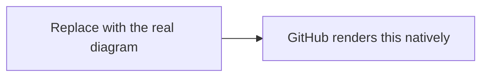

<!--
  COREX HANDBOOK PAGE TEMPLATE (spec 028).
  Copy this file, fill the front-matter, delete these HTML comments, and write the page.
  The rules below are not optional — they are what makes the handbook usable by someone
  with zero prior Corex (and sometimes zero prior DevOps) experience.

  RULES (from specs/028-developer-handbook/contracts/page-contract.md):
  1. Beginner-first. Do NOT write "simply" or "just". Do not skip a step as "obvious".
  2. Define every term before using it. Link domain terms to ../../_glossary.md.
  3. The FIRST time you mention an external tool on this page, introduce it inline:
       - one sentence: what it is;
       - install on Windows / Linux (apt) / macOS (brew);
       - a verify command + its expected output.
  4. EVERY command is a language-tagged fenced block, immediately followed by a SECOND
     fenced block showing the EXPECTED OUTPUT. No bare backticks; always a language tag.
  5. LINK, never duplicate: for architecture or class-reference content, link to docs-app
     (the published site) — do not copy it here. See docs/README.md → "What lives where".
  6. If you reference a class / command / hook / flag that is NOT yet built, set this page's
     stability to `planned` (or mark the line) and link to the Spec Kit module that will
     produce it. Never invent names.
  7. Every architecture / lifecycle / deployment-topology page has at least one Mermaid
     diagram (```mermaid) — GitHub renders it natively, no image build.
-->

## What you'll do on this page

<!-- One short paragraph: the outcome, and who this is for (the audience tier above). -->

## Before you start

<!-- Prerequisites. Introduce each external tool the first time (see rule 3). Example: -->

> **WP-CLI** is the command-line interface for WordPress — you run Corex's `wp corex …`
> commands through it.
>
> - Windows: download `wp-cli.phar` from <https://wp-cli.org> (or use the copy bundled with WAMP).
> - Linux / macOS:
>
> ```bash
> curl -O https://raw.githubusercontent.com/wp-cli/builds/gh-pages/phar/wp-cli.phar
> chmod +x wp-cli.phar && sudo mv wp-cli.phar /usr/local/bin/wp
> ```
>
> Verify it is installed:
>
> ```bash
> wp --version
> ```
>
> Expected output (your version may differ):
>
> ```text
> WP-CLI 2.11.0
> ```

## Steps

<!-- Numbered steps. Each command + its expected output. Example: -->

1. Do the thing.

   ```bash
   wp theme list --path=wp
   ```

   Expected output:

   ```text
   +-------+----------+--------+---------+
   | name  | status   | update | version |
   +-------+----------+--------+---------+
   | corex | active   | none   | 0.19.0  |
   +-------+----------+--------+---------+
   ```

## Diagram (if this page shows architecture / a topology / a lifecycle)



## Where to next

<!-- Links to the logical next pages. -->

## See also

<!-- Links INTO docs-app for architecture / class reference, and to ../../_glossary.md. -->
